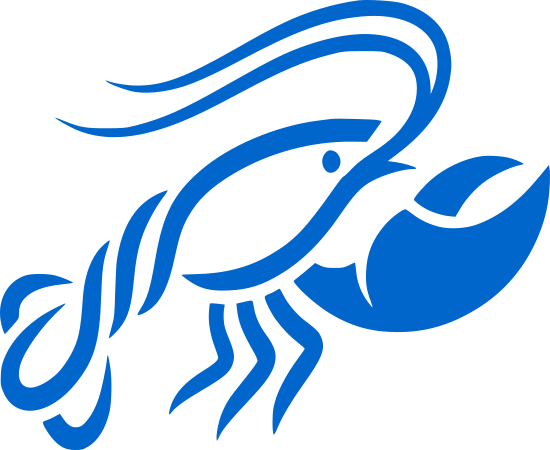
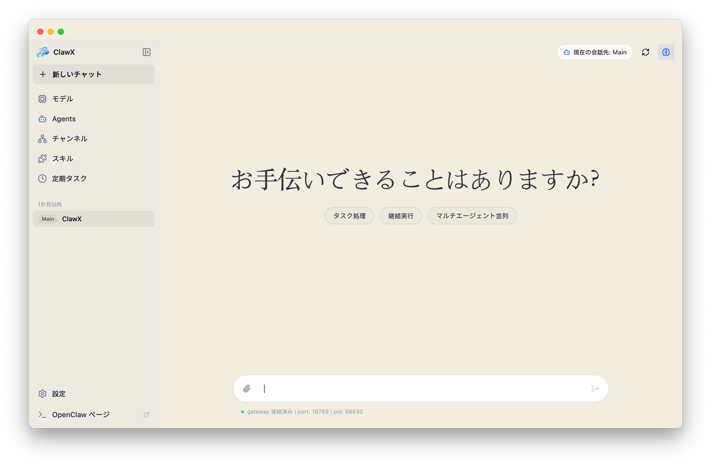
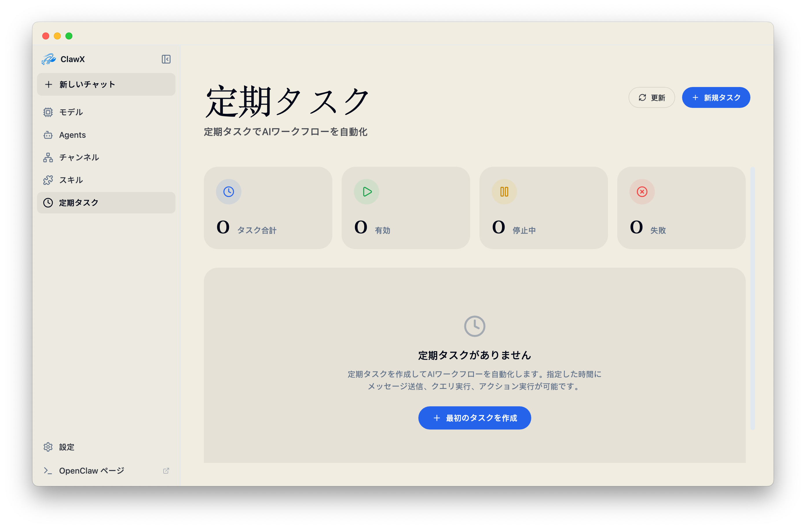
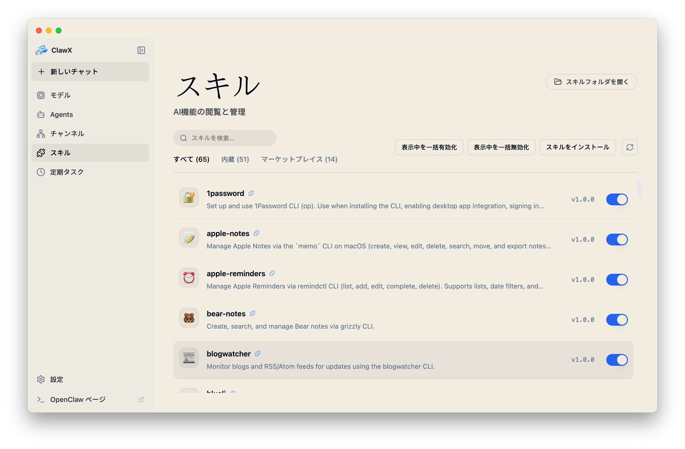
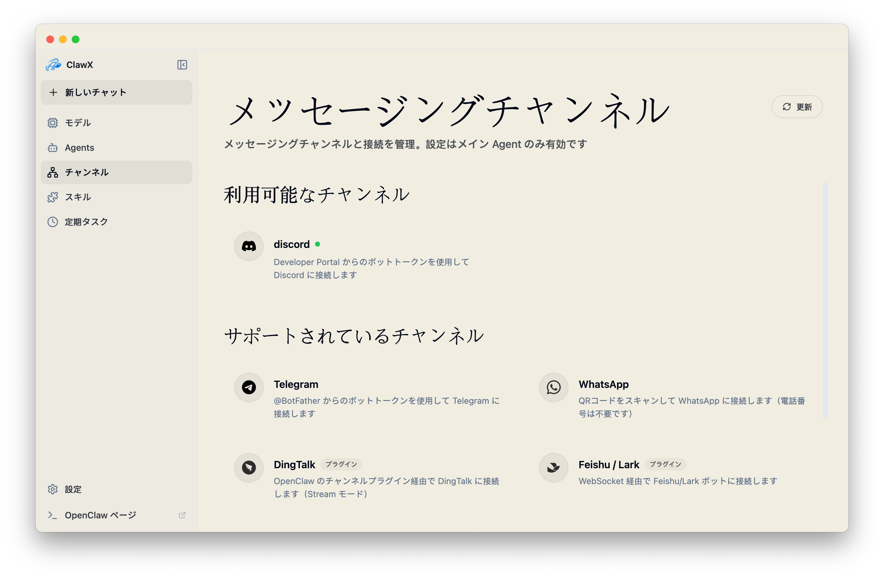
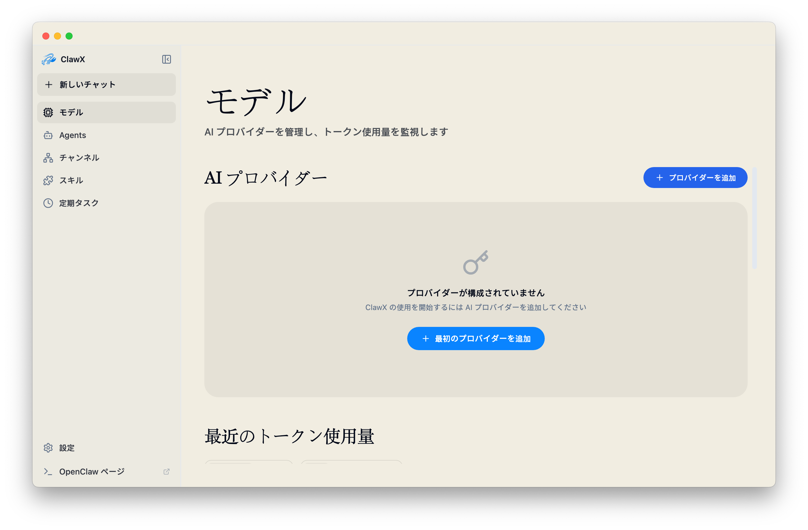
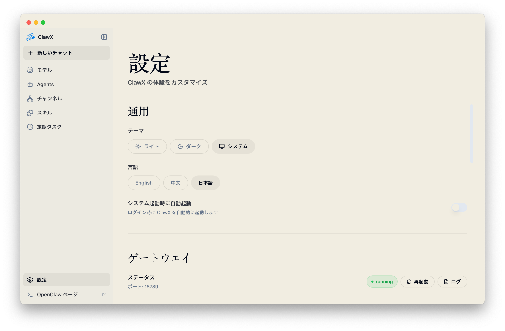

<p align="center">
  
</p>

<h1 align="center">ClawX</h1>

<p align="center">
  <strong>OpenClaw AIエージェントのためのデスクトップインターフェース</strong>
</p>

<p align="center">
  <a href="#clawxを選ぶ理由">ClawXを選ぶ理由</a> •
  <a href="#はじめに">はじめに</a> •
  <a href="#アーキテクチャ">アーキテクチャ</a> •
  <a href="#開発">開発</a> •
  <a href="#コントリビューション">コントリビューション</a>
</p>

<p align="center">
  
  
  
  <a href="https://discord.com/invite/84Kex3GGAh" target="_blank">
  
  </a>
  
  
</p>

<p align="center">
  <a href="README.md">English</a> | <a href="README.zh-CN.md">简体中文</a> | 日本語 | <a href="README.ru-RU.md">Русский</a>
</p>

---

## 概要

**ClawX**は、強力なAIエージェントと日常のユーザーとの間のギャップを埋めます。[OpenClaw](https://github.com/OpenClaw)をベースに構築されており、コマンドラインによるAIオーケストレーションを、使いやすく美しいデスクトップ体験に変換します。ターミナルは必要ありません。

ワークフローの自動化、AI搭載チャネルの管理、インテリジェントなタスクのスケジューリングなど、ClawXはAIエージェントを効果的に活用するために必要なインターフェースを提供します。

ClawXにはベストプラクティスに基づくモデルプロバイダーがあらかじめ設定されており、Windowsと多言語設定をネイティブにサポートしています。コンパクション予約はモデルにコンテキストウィンドウが明示されている場合のみその25%を使用し、メタデータがない場合は保守的な既定値50000トークンを使用します。完了済みターンは圧縮後に逐語的に再生されず、要約を通じて引き継がれます。開発者モードでは適用された予約値を確認できます。高度な設定は **設定 → 詳細設定 → 開発者モード** から調整できます。

<p align="center"><strong style="font-size:1.1em; text-decoration: underline;">完全なエンタープライズ版、専用サービスサポート、またはビジネスシナリオに合わせた導入支援が必要な場合は、<a href="mailto:public@valuecell.ai">public@valuecell.ai</a> までお問い合わせください。</strong></p>

## スクリーンショット

<table>
  <tr>
    <td align="center"><br><em>チャット</em></td>
    <td align="center"><br><em>スケジュールタスク</em></td>
  </tr>
  <tr>
    <td align="center"><br><em>スキル</em></td>
    <td align="center"><br><em>チャネル</em></td>
  </tr>
  <tr>
    <td align="center"><br><em>モデル</em></td>
    <td align="center"><br><em>設定</em></td>
  </tr>
</table>

## ClawXを選ぶ理由

AIエージェントの構築にコマンドラインの習得は不要であるべきです。ClawXはシンプルな哲学のもとに設計されました：**強力な技術には、あなたの時間を尊重するインターフェースがふさわしい。** ClawXは公式の **OpenClaw** コアを直接ベースに構築されています。別途インストールする必要はなく、ランタイムをアプリケーション内に組み込むことで、シームレスな「すべて込み」の体験を提供します。上流のOpenClawと緊密に連携し、公式の最新機能、安定性の改善、エコシステムとの互換性を利用できるようにしています。

| 課題 | ClawXのソリューション |
|------|----------------------|
| 複雑なCLIセットアップ | ガイド付きセットアップウィザードによるワンクリックインストール |
| 設定ファイル | リアルタイム検証付きのビジュアル設定 |
| プロセス管理 | Gatewayライフサイクルの自動管理 |
| アプリの更新 | 起動時に更新を確認し、ダウンロードまたはインストール前に通知 |
| 複数のAIプロバイダー | 統合プロバイダー設定パネル |
| スキル/プラグインのインストール | オプションの拡張機能マーケットプレイスにも対応したローカル優先のスキル管理 |

### 機能

- **🎯 ゼロ設定バリア**：直感的なグラフィカルインターフェースでセットアップを完了できます。ターミナルコマンド、YAMLファイル、環境変数の探索は不要です。
- **💬 インテリジェントチャットインターフェース**：複数セッションのコンテキストと履歴、シンタックスハイライト付きストリーミングMarkdown、CJK対応解析、テーブル、KaTeX数式、`@agent` による直接ルーティング、インライン `/skill` カード、埋め込みサブエージェントの状態表示・ライブ更新される読み取り専用の子会話・直接の親会話への復帰、ワークスペース優先のセッション、Markdown・`.docx`・`.pptx`・ローカルHTMLの読み取り専用プレビューに対応します。
- **🎙️ 音声入力**：チャット入力欄のマイクボタンで音声を録音し、設定済みの音声認識サービスで文字起こししてカーソル位置に挿入します。**モデル → 音声入力** タブで API タイプ（OpenAI Audio Transcriptions または `input_audio` 方式の OpenAI Chat Completions）とプリセット（OpenAI・Groq・SiliconFlow・Alibaba Cloud Model Studio・カスタム）および API キーを設定できます。
- **🤖 Agentライフサイクル管理**：デスクトップから専用Agentを作成・管理できます。既定以外のAgentを削除するには明示的な確認が必要です。削除するとClawX管理下のワークスペースと関連するすべてのチャット履歴が完全に消去され、該当する会話と削除済みワークスペース項目はチャット画面から直ちに消え、復元できません。
- **🧰 問題調査レポートのエクスポート**：「設定 > サポート」で内容を確認し、認証情報を除去した OpenClaw 設定と利用可能な診断ログを含む ZIP をデスクトップに作成できます。会話の選択は任意で、選択した場合は利用可能な JSONL も含まれ、完了後に保存先を表示します。
- **📡 マルチチャネル管理**：複数アカウント、アカウント単位のAgent紐付け、既定アカウントの切り替え、Tencent公式個人WeChatチャネルプラグイン、既存の `dingtalk` チャネルにリマップした公式 DingTalk コネクタ（カレンダー/ドキュメントにはプラグインスキルと `dws` が必要）を備えた独立したAIチャネルを設定・監視できます。
- **⏰ Cronベースの自動化**：繰り返しまたは1回限りのスケジュールを定義し、スケジュール済みプロンプトにスキルを挿入し、結果を外部チャネルへ配信できます。
- **🧩 拡張可能なスキルシステム**：Gatewayに依存せずスキルをローカルで管理できます。複数のOpenClawソースからスキルを検出し、`pdf`、`xlsx`、`docx`、`pptx` の文書処理スキルも利用できます。
- **🔐 セキュアなプロバイダー統合**：OpenAI、Anthropic、Z.AI / GLMなどに接続し、認証情報をOSのネイティブキーチェーンに安全に保存できます。カスタムプロバイダーや互換性フォールバックも利用でき、インターフェース言語が中国語の場合は、PKCEとClawXリクエスト帰属付きのブラウザOAuthに対応するTokenDanceもプロバイダーカタログに表示されます。開発者モードでは **Models → Image Generation** で画像生成エンドポイントを設定できます。
- **💻 ローカルComputer Use**：macOS 13以上（IntelまたはAppleシリコン）とWindows x64では、同梱のネイティブCUA CLIでウィンドウ、アクセシビリティ要素、メニュー、デスクトップを操作し、結果を検証できます。プライマリ画面の取得と入力も引き続き利用できます。ドライバーはローカルで動作し、OpenClawノードのペアリングや実行時の追加ダウンロードは不要です。
- **🌙 アダプティブテーマ**：ライト、ダーク、システム同期テーマを選択できます。
- **🚀 自動起動設定**：**設定 → 一般** で **システム起動時に自動起動** を有効にできます。
- **🔔 更新通知**：起動時に新しいバージョンを確認し、ダウンロードまたはインストールするかを選択できます。

> 機能の詳細は [docs/ja-JP/features.md](docs/ja-JP/features.md) を参照してください。

### 主なユースケース

- **🤖 パーソナルAIアシスタント**：質問への回答、メールの下書き、ドキュメントの要約、日常タスクの支援を行う汎用AIエージェントを、クリーンなデスクトップインターフェースから設定できます。
- **📊 自動モニタリング**：ニュースフィード、価格、特定のイベントを監視するスケジュールエージェントを設定し、結果を希望する通知チャネルへ届けられます。
- **💻 開発者の生産性向上**：AIを開発ワークフローに統合し、コードレビュー、ドキュメント生成、繰り返しのコーディング作業を行えます。
- **🔄 ワークフロー自動化**：複数のスキルをビジュアルな自動化パイプラインに組み合わせ、データ処理、コンテンツ変換、アクションの実行を行えます。

## はじめに

### システム要件

- **オペレーティングシステム**：macOS 11以上、Windows 10以上、またはLinux（Ubuntu 20.04以上）
- **Computer Use**：macOS 13以上のx64/arm64、またはWindows 10以上のx64。他の対応プラットフォームでもClawXは利用できますが、この機能は提供されません
- **メモリ**：最低4GB RAM（8GB推奨）
- **ストレージ**：1GBの空きディスク容量

### インストール

#### ビルド済みリリース（推奨）

[Releases](https://github.com/ValueCell-ai/ClawX/releases) ページから、お使いのプラットフォーム向けの最新リリースをダウンロードしてください。

#### ソースからビルド

```bash
# リポジトリをクローン
git clone https://github.com/ValueCell-ai/ClawX.git
cd ClawX

# プロジェクトを初期化
pnpm run init

# 開発モードで起動
pnpm dev
```

### 初回起動

ClawXを初めて起動すると、**セットアップウィザード**が次の手順を案内します。

1. **言語と地域**：使用するロケールを設定
2. **AIプロバイダー**：ブラウザまたはデバイスログインに対応したプロバイダーでは、APIキーまたはOAuthで追加
3. **スキルバンドル**：一般的なユースケース向けの事前設定スキルを選択
4. **検証**：メインインターフェースに入る前に設定をテスト

サポートされている場合、ウィザードはシステム言語を初期選択し、対応していない場合は英語にフォールバックします。

### ローカルComputer Use

ClawX は CUA SDK と Driver **0.25.0** を同梱します。macOS と Windows では、Main の組み込み daemon オプションと Gateway 経由の CLI 環境の両方に `CUA_DRIVER_RS_TELEMETRY_ENABLED=false` を設定し、CUA の製品テレメトリを無効にします。SDK は 0.22.0 からこの変数を許可しており、0.21.0 の CLI のみを対象とした暫定対応に代わるものです。システム環境変数、単独の CUA インストールの設定、ClawX 自体のテレメトリ設定は変更しません。

Windows の PE サブシステムをコンソールから GUI に変更するパッチは、テレメトリの無効化とともに維持します。固定した上流ソースは今もテレメトリに `cmd /c ver` を使用しており、ウィンドウを表示しない起動が自動的に修正されたわけではありません。以前の Windows ユーザー報告は 0.21.0 に関するもので、再ビルドした Windows 0.25.0 の起動、CLI 出力、点滅の有無は引き続きネイティブ検証が必要です。[検証履歴と制限](harness/reference/computer-use-cli-validation.md)を参照してください。

画像入力に対応したモデルとプロバイダーのエンドポイントを使用してください。画面取得の成功だけでは、モデルが画像を見られるとは限りません。プロバイダー同期では、既知の画像対応モデルの欠落した入力メタデータを補完し、明示的なテキスト専用設定は保持します。未知のモデルはテキスト専用のままです。画像非対応と表示された場合は、画面を確認できないままキー入力を続けず、選択したプロバイダーとモデルを確認してください。

Computer Use は任意の機能で、明示的な設定のない既存環境も含めて**初期状態では無効**です。設定で**開発者モード**を有効にしてから、サイドバーの**コンピューター操作**でこの機能を有効にしてください。設定は再起動後も保持されます。Electron Main が内蔵ドライバーサービスと権限を管理し、無効化するとサービスを停止して非公開の接続情報を削除します。リモート検出や OpenClaw ノードのペアリングは行いません。

Agent は OpenClaw の既存の `exec` ツールで同梱のネイティブ CUA CLI を呼び出し、画像対応の `read` ツールでスクリーンショットファイルを確認します。この経路に ClawX の `computer` ツール、OpenClaw プラグイン、MCP プロキシはありません。対応プラットフォームでは、ウィンドウ、アクセシビリティ要素（AX）、メニュー、ブラウザ・録画操作、`verify_state` など、固定バージョン CLI のネイティブ機能全体を利用でき、ClawX 独自の操作サブセットには制限されません。プライマリ画面の取得、移動、クリック、ドラッグ、スクロール、入力、キー操作、上限付き待機も引き続き利用できます。各コマンドはプラットフォーム、アプリ、OS 権限の制約を受けます。

macOS の管理画面では**アクセシビリティ**と**画面収録**の状態を読み取り専用で表示します。起動、アクティブ化、トグルの有効化では権限を要求しません。有効にしてから**権限を要求**を押してください。要求してもシステムのダイアログが再表示されるとは限りません。未許可のままなら操作案内を表示します。システム設定 > プライバシーとセキュリティでアクセシビリティと画面収録およびシステムオーディオ録音（旧 macOS では画面収録）を確認してください。対象は実際に表示されるアプリです。インストール版では通常 ClawX、開発環境では起動元のターミナルや IDE（Ghostty、VS Code など）の場合があります。変更後は ClawX を、必要なら起動元も再起動してください。画面収録の確認では未要求と以前の拒否を区別できません。機能を無効にしても OS の許可は取り消されません。権限やドライバーが不足しても Chat や Gateway の起動は妨げません。

同梱の **computer-use** Skill は `/computer-use` コマンドを維持し、[CUA 0.25.0 に付属する公式 Skill](https://github.com/trycua/cua/tree/45d78fedcf2c7033ba33f10dd30f8af8ba31ec3f/libs/cua-driver/rust/Skills/cua-driver)に基づいています。参照元はタグ `cua-driver-rs-v0.25.0`、コミット `45d78fedcf2c7033ba33f10dd30f8af8ba31ec3f` に固定され、更新され続ける上流の `main` ではありません。MIT ライセンスの文書とライセンスをオフラインで同梱し、Main の接続先、権限、セッション、画像処理に関する短い ClawX 専用ガイドを入口にしています。

**ClawX は `~/.openclaw/skills/computer-use` ディレクトリ全体を管理します。** 起動するたびに、現在の同梱内容と異なる同名のインストールを丸ごと置き換えます。ユーザーの編集は上書きされ、追加ファイルやディレクトリも削除されます。内容が一致する場合は変更しません。カスタム版には別の Skill 名とディレクトリを使用してください。別名の Skill や設定（Computer Use の有効・無効の設定を含む）は変更しません。コピーは一時領域で準備し、配置に失敗した場合のロールバックを維持します。同名のシンボリックリンクはリンク自体を置き換え、外部のリンク先をたどったり削除したりしません。比較対象は現在の同梱内容であり、過去のインストールハッシュは管理しません。公式 CUA 0.25.0 文書のバイト列や出典の検証も変更しません。Skill の選択でサービスや OS 権限は有効になりません。[Skill の出典と統合](harness/reference/computer-use-skill.md)を参照してください。

スクリーンショットは現在のローカル Agent ワークスペース内のタスク専用ディレクトリに保存されますが、モデルに画像を読ませると内容がモデルのプロバイダーへ送信される場合があります。機密性の高いウィンドウを撮影しないでください。ローカル実行、ワークスペースへのアクセス、モデルとプロバイダーの画像対応が必要です。非対応のサンドボックスやリモート環境では制限を報告し、グローバルな shell 承認を緩めたり別のドライバーを起動したりしません。Skill は shell サンドボックスやグローバルな操作ロックではありません。`exec` のキャンセルは受理済みのネイティブ操作を取り消せず、緊急停止も保証しません。ドライバー再起動後や完了状態が不明な場合は、接続先を再取得して状態を観察し、入力を無条件に繰り返さないでください。重大な影響を伴う操作や外部への操作には確認が必要です。

> Web検索について：ClawXはAgentとGatewayの両方のポリシーレイヤーで、OpenClawの汎用 `web_search` ツールを無効にします。Moonshot（Kimi）検索も対象です。管理対象のブラウザ自動化と `web_fetch` は引き続き利用できます。
>
> 内部ツールについて：ClawXは両方のポリシーレイヤーで、Agentに対して `gateway`、`nodes`、`create_goal`、`get_goal`、`update_goal` も無効にします。ClawXアプリケーション自身のGateway RPCに加え、メッセージング、セッションオーケストレーション、Agent検出ツールは引き続き利用できます。

### プロキシ設定

ClawXには、Electron、OpenClaw Gateway、Telegramなどのチャネルがローカルプロキシクライアント経由でインターネットにアクセスする必要がある環境向けの、組み込みプロキシ設定があります。

**設定 → Gateway → プロキシ**を開き、既定のプロキシ、バイパスルール、開発者モードでのHTTP・HTTPS・`ALL_PROXY` / SOCKSの上書きを設定します。ローカル設定の例は `http://127.0.0.1:7890` です。

> プロキシのフォールバック動作、Telegramとの同期、**OpenClaw Doctor**については [docs/ja-JP/proxy-settings.md](docs/ja-JP/proxy-settings.md) を参照してください。

## アーキテクチャ

ClawXは **Host API統一レイヤーを備えたデュアルプロセスアーキテクチャ**を採用しています。React Rendererは単一のクライアント抽象を呼び出し、Electron Mainがプロトコル選択、Gatewayのライフサイクル、ACP Chatのstdio bridgeを管理します。

- **プロセスモデル**：Electron Mainがウィンドウ、Gateway監視、システム統合、更新を管理します。OpenClaw GatewayはAIオーケストレーション、チャネル、スキル機能を提供し、Rendererはローカルエンドポイントへ直接アクセスしません。
- **ローカルComputer Use**：Electron Main は `EmbeddedCuaDriverHost`、ネイティブ SDK の読み込み、権限確認、daemon の監督を維持します。`CLAWX_CUA_CONNECTION_FILE` は非公開の記述子 `{ v: 2, generation, driverVersion, binaryPath, socketPath }` を指します。OpenClaw の既存の `exec` が同梱バイナリの絶対パスと明示的な socket で CLI を呼び出し、`read` がモデルへ画像を渡します。独自プラグイン、MCP プロキシ、node host、ペアリング、実行時ダウンロードは使用しません。
- **設定の配信**：Gateway実行中は `config.get` / `config.set` を使い、停止中または起動中は解決済みJSON5設定を更新します。通常のプロバイダー、Agent、スキル、モデル変更ではプロセスを置き換えず、認証情報は `secrets.reload` でホットリロードされます。検証済みのGatewayアクティビティが3分間ない場合、ClawXはコアRPCを検証し、自身が所有する利用不能なGatewayプロセスだけを再起動します。外部管理のGatewayは手動で復旧します。
- **ACP Chat**：Chat UIは [ACP（Agent Client Protocol）](https://agentclientprotocol.com) を介してOpenClawとやり取りし、頻繁に反復されるOpenClawの前に比較的安定したチャットプロトコル面を確保します。ACPはMainが所有するstdio bridge経由で動作し、設定リロード後の認証済み履歴リプレイ、ページ移動中のストリーミング、Mainが検証したメディア・添付ファイル・ファイルアクティビティに対応します。保護されたGateway再起動によって受理済みターンが中断された場合、パッチ済みOpenClawランタイムは復旧runを元のACP promptへ明示的に関連付け、後続のテキストとツールアクティビティを同じメモリ内ターンで継続します。その後の履歴リプレイでも、永続化されたツール境界をネイティブACP updateとして復元します。最終応答の永続化後に再起動して終端通知が失われた場合も、runとセッションに限定した照合によってpending promptを完了し、Chatが実行中のまま残ることを防ぎます。
- **設計原則**：フロントエンドの単一入口、Mainによるトランスポート管理、再接続・タイムアウト・バックオフによるグレースフルリカバリ、安全なストレージ、CORSセーフな境界を採用しています。

> プロセス図、設定の調整、ACPファイルアクティビティのセマンティクス、Gatewayのトラブルシューティングについては [docs/ja-JP/architecture.md](docs/ja-JP/architecture.md) を参照してください。

## 開発

### 前提条件

- **Node.js**：対応するメジャー系列の22.22.3以上、24.15.0以上、または25.9.0以上（Node 24 LTS推奨）
- **パッケージマネージャー**：pnpm 9以上（npmも対応）
- **Linux（Ubuntu/Debian）**：Electronの実行前に必要なシステムライブラリをインストールしてください。詳細は [docs/ja-JP/development.md](docs/ja-JP/development.md) を参照してください。

### よく使うコマンド

```bash
pnpm run init        # 依存関係をインストールし、バンドルランタイムをダウンロード
pnpm dev             # ホットリロード付きで開発モードを起動
pnpm lint            # ESLintを実行
pnpm typecheck       # TypeScriptを検証
pnpm test            # ユニットテストを実行
pnpm run test:e2e    # Electron E2Eスモークテストを実行
pnpm build           # 本番ビルドを実行
pnpm package         # 現在のプラットフォーム向けにパッケージ化（:mac / :win / :linux）
```

> プロジェクト構成、完全なコマンド一覧、E2Eの並列実行ポリシー、パフォーマンス診断、通信回帰チェック、技術スタックについては [docs/ja-JP/development.md](docs/ja-JP/development.md) を参照してください。

## コントリビューション

コミュニティからの貢献を歓迎します。バグ修正、新機能、ドキュメントの改善、翻訳など、あらゆる貢献がClawXをより良くします。

### 貢献方法

1. リポジトリを**フォーク**する
2. フィーチャーブランチを**作成**する（`git checkout -b feature/amazing-feature`）
3. 明確なメッセージで変更を**コミット**する
4. ブランチに**プッシュ**する
5. **Pull Request**を作成する

### ガイドライン

- 既存のコードスタイル（ESLint + Prettier）に従う
- 新機能にはテストを書く
- 必要に応じてドキュメントを更新する
- コミットはアトミックかつ説明的に保つ

## 謝辞

ClawXは次の優れたオープンソースプロジェクトの上に構築されています。

- [OpenClaw](https://github.com/OpenClaw) - AIエージェントランタイム
- [LobsterAI](https://github.com/netease-youdao/lobsterai) - Gatewayの存活信号と復旧設計の着想元
- [Electron](https://www.electronjs.org/) - クロスプラットフォームデスクトップフレームワーク
- [React](https://react.dev/) - UIコンポーネントライブラリ
- [shadcn/ui](https://ui.shadcn.com/) - 美しく設計されたコンポーネント
- [Zustand](https://github.com/pmndrs/zustand) - 軽量な状態管理
- [LobeHub Icons](https://lobehub.com/zh/icons) - チャットモデルセレクターで使用しているモデルアイコン

## コミュニティ

コミュニティに参加して、他のユーザーと交流し、サポートを受け、体験を共有しましょう。

| 企業WeChat | Feishuグループ | Discord |
| :---: | :---: | :---: |
|  |  |  |

### ClawXパートナープログラム

ClawXをより多くのお客様、特にカスタムAIエージェントや自動化のニーズを持つお客様に紹介してくださるパートナーを募集しています。

パートナーは見込みユーザーやプロジェクトとの接点づくりを担い、ClawXチームは技術サポート、カスタマイズ、統合を全面的に提供します。AIツールや自動化に関心のあるお客様と仕事をされている方は、ぜひご一緒ください。

詳細はDM、または [public@valuecell.ai](mailto:public@valuecell.ai) までお問い合わせください。

## Star History

<p align="center">
  
</p>

## ライセンス

ClawXは [MITライセンス](LICENSE) のもとで公開されています。本ソフトウェアは自由に使用、変更、配布できます。

<hr>

<p align="center">
  <sub>ValueCell Teamが❤️を込めて開発</sub>
</p>
