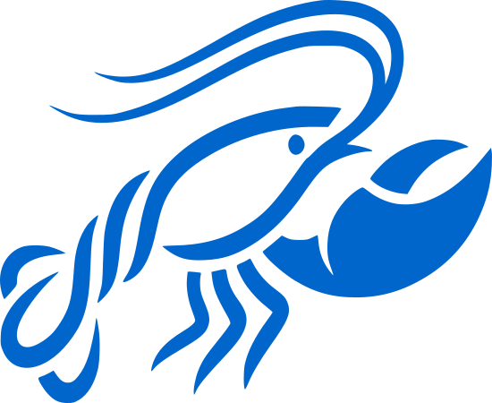
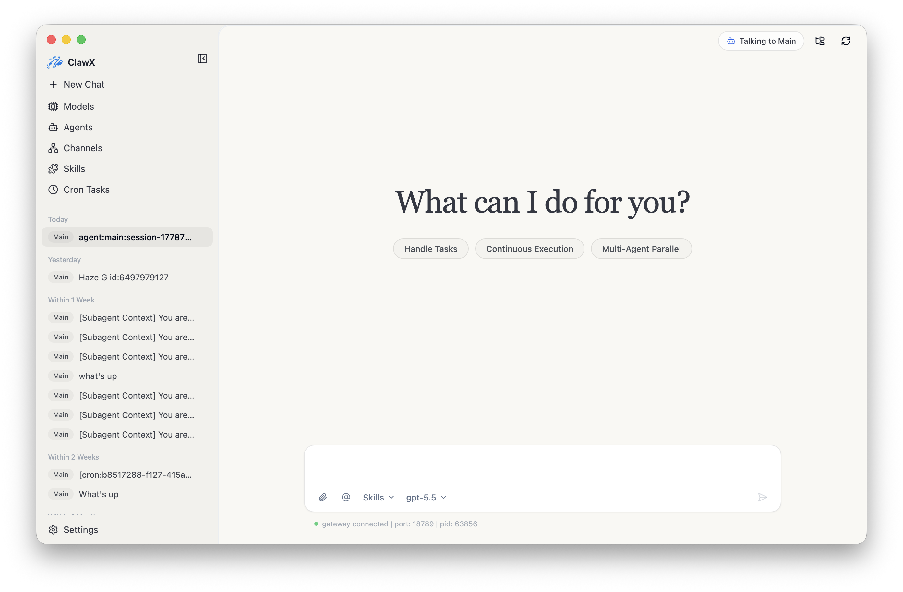
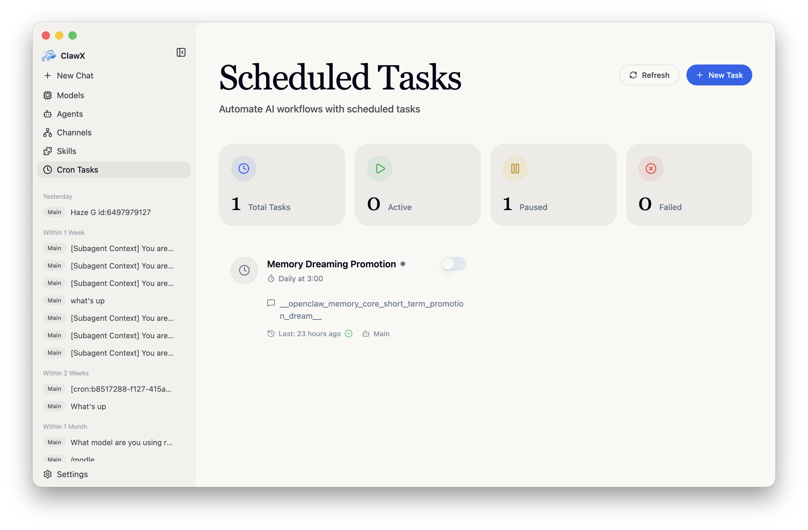
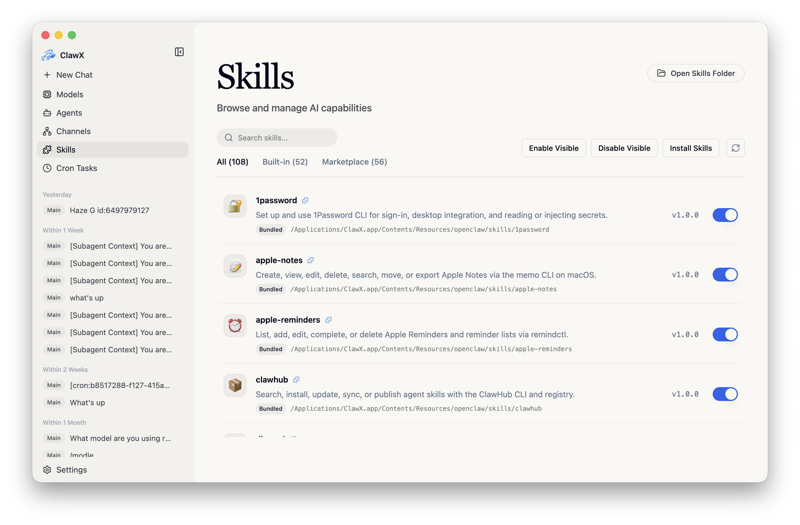
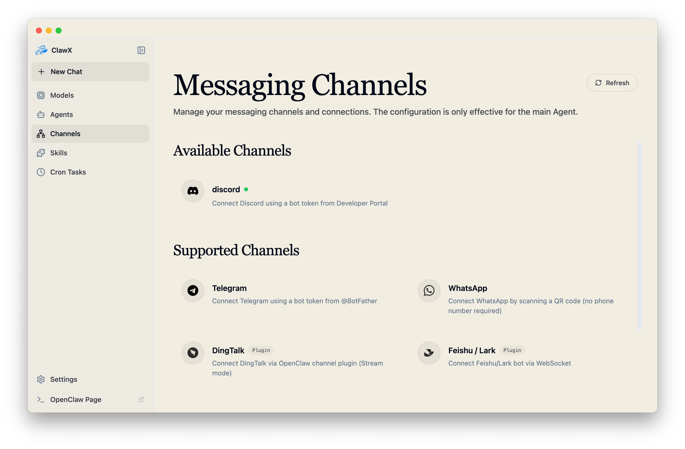
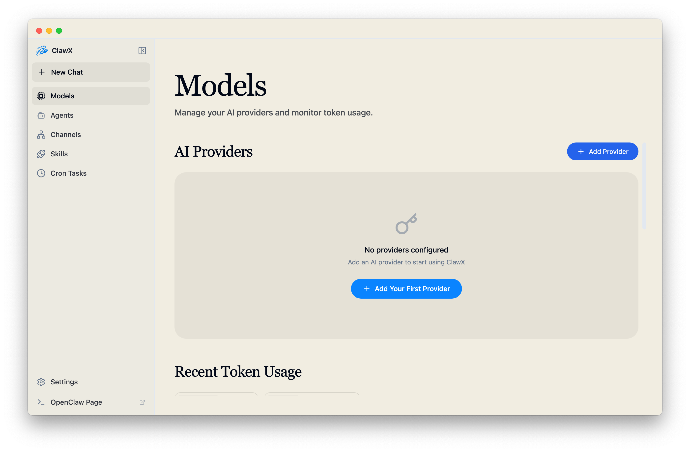
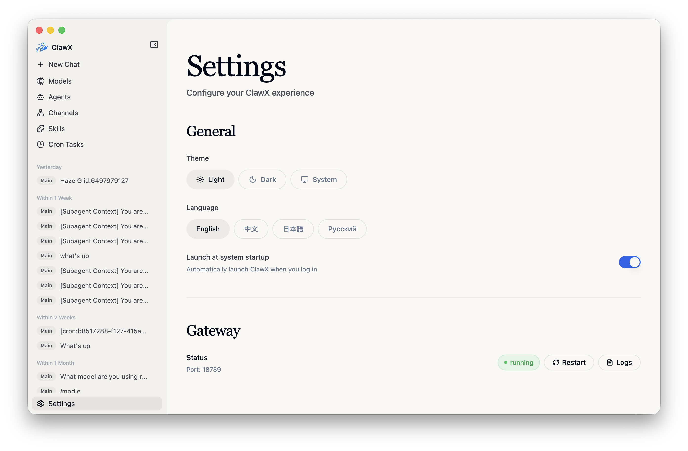

<p align="center">
  
</p>

<h1 align="center">ClawX</h1>

<p align="center">
  <strong>The Desktop Interface for OpenClaw AI Agents</strong>
</p>

<p align="center">
  <a href="#features">Features</a> •
  <a href="#why-clawx">Why ClawX</a> •
  <a href="#getting-started">Getting Started</a> •
  <a href="#architecture">Architecture</a> •
  <a href="#development">Development</a> •
  <a href="#contributing">Contributing</a>
</p>

<p align="center">
  
  
  
  <a href="https://discord.com/invite/84Kex3GGAh" target="_blank">
  
  </a>
  
  
</p>

<p align="center">
  English | <a href="README.zh-CN.md">简体中文</a> | <a href="README.ja-JP.md">日本語</a> | <a href="README.ru-RU.md">Русский</a>
</p>

---

## Overview

**ClawX** bridges the gap between powerful AI agents and everyday users. Built on top of [OpenClaw](https://github.com/OpenClaw), it transforms command-line AI orchestration into an accessible, beautiful desktop experience—no terminal required.

Whether you're automating workflows, managing AI-powered channels, or scheduling intelligent tasks, ClawX provides the interface you need to harness AI agents effectively.

ClawX comes pre-configured with best-practice model providers and natively supports Windows as well as multi-language settings. Of course, you can also fine-tune advanced configurations via **Settings → Advanced → Developer Mode**.

<p align="center"><strong style="font-size:1.1em; text-decoration: underline;">For a full enterprise edition, dedicated service support, or tailored deployment guidance for your business scenario, contact us at <a href="mailto:public@valuecell.ai">public@valuecell.ai</a>.</strong></p>

---
## Screenshot

<p align="center">
  
</p>

<p align="center">
  
</p>

<p align="center">
  
</p>

<p align="center">
  
</p>

<p align="center">
  
</p>

<p align="center">
  
</p>

---

## Why ClawX

Building AI agents shouldn't require mastering the command line. ClawX was designed with a simple philosophy: **powerful technology deserves an interface that respects your time.**

| Challenge | ClawX Solution |
|-----------|----------------|
| Complex CLI setup | One-click installation with guided setup wizard |
| Configuration files | Visual settings with real-time validation |
| Process management | Automatic gateway lifecycle management |
| App updates | Startup update checks with a prompt before downloading or installing |
| Multiple AI providers | Unified provider configuration panel |
| Skill/plugin installation | Local-first skill management with optional extension-provided marketplace |

### OpenClaw Inside

ClawX is built directly upon the official **OpenClaw** core. Instead of requiring a separate installation, we embed the runtime within the application to provide a seamless "battery-included" experience.

We are committed to maintaining strict alignment with the upstream OpenClaw project, ensuring that you always have access to the latest capabilities, stability improvements, and ecosystem compatibility provided by the official releases.

When Developer Mode is enabled and OpenClaw is the active runtime, the sidebar also provides a native Dreams page for OpenClaw memory review, dream diary inspection, and basic maintenance actions. The full upstream OpenClaw Dreams UI remains available from that page when deeper diagnostics are needed.

ClawX also includes a runtime abstraction layer. OpenClaw remains the default runtime and rollback path, while **Settings → Gateway → Runtime** can switch to an optional bundled `cc-connect` runtime. Packaged builds include both the cc-connect binary and the native OpenAI Codex CLI bundle in app resources; runtime startup does not depend on global installs, PATH binaries, or app-time downloads. cc-connect uses a ClawX-managed configuration directory under app user data instead of modifying `~/.cc-connect`, and GUI chat connects through cc-connect BridgePlatform with Codex as the project agent. ClawX mirrors each configured agent as its own cc-connect project so selected agents keep their OpenClaw workspace. Provider/model selections, cron tasks, and enabled skills are synchronized into the managed cc-connect/Codex runtime.

In cc-connect mode, Codex provider sync supports OpenAI API key, OpenAI OAuth/Codex, Ollama, and Custom OpenAI-compatible providers that expose the Responses API. Custom provider headers are written as environment-variable references so secrets and session headers are not persisted in managed config files. Custom providers configured for Chat Completions are reported as unsupported before chat delivery because Codex accepts the Responses wire API for this path.

cc-connect also owns messaging platform bridges. When cc-connect is the active runtime, channel status probes are routed through the runtime abstraction instead of the OpenClaw Gateway, configured channel accounts are mirrored into the cc-connect project that owns their bound agent, and channel saves/deletes restart the managed cc-connect runtime so platform changes take effect. The Developer Mode sidebar page shortcut opens cc-connect Web Admin, while the OpenClaw Dreams shortcut remains OpenClaw-only.

---

## Features

### 🎯 Zero Configuration Barrier
Complete the entire setup—from installation to your first AI interaction—through an intuitive graphical interface. No terminal commands, no YAML files, no environment variable hunting.

### 💬 Intelligent Chat Interface
Communicate with AI agents through a modern chat experience. Support for multiple conversation contexts, message history, rich content rendering with Markdown (including GitHub-flavored tables and KaTeX-powered LaTeX math: `$inline$`, `$$block$$`, `\(inline\)`, and `\[block\]`), and direct `@agent` routing in the main composer for multi-agent setups.
Skills you insert from the composer appear as `/skill-name` chips; click a chip to open the preview sidebar and read that skill's `SKILL.md`.
When you target another agent with `@agent`, ClawX switches into that agent's own conversation context directly instead of relaying through the default agent. Agent workspaces stay separate by default, and stronger isolation depends on OpenClaw sandbox settings.
Each agent can also override its own `provider/model` runtime setting; agents without overrides continue inheriting the global default model.

### 📡 Multi-Channel Management
Configure and monitor multiple AI channels simultaneously. Each channel operates independently, allowing you to run specialized agents for different tasks.
Each channel now supports multiple accounts, per-account agent binding, and switching the channel default account directly from the Channels page.
For custom channel account IDs, ClawX enforces OpenClaw-compatible canonical IDs (`[a-z0-9_-]`, lowercase, max 64 chars, must start with a letter/number) to prevent routing mismatches.
ClawX now also bundles Tencent's official personal WeChat channel plugin, so you can link WeChat directly from the Channels page with an in-app QR flow.

### ⏰ Cron-Based Automation
Schedule AI tasks to run automatically. Define triggers, set intervals, and let your AI agents work around the clock without manual intervention.
The Cron page now lets you configure external delivery directly in the task form with separate sender-account and recipient-target selectors. For supported channels, recipient targets are discovered automatically from channel directories or known session history, so you no longer need to edit `jobs.json` by hand. The task message field also supports inserting skills with the same inline `/skill` token syntax as the main chat composer (scoped to the selected agent), so scheduled prompts can trigger skills directly. The schedule picker is split into **Recurring** and **Once** tabs: Recurring offers Hourly, Daily, Weekdays, Weekly, and Custom (raw cron) frequencies with inline time/weekday controls, while Once runs the task a single time at a chosen date (with weekday shown) and time. One-time tasks must be scheduled for a future moment and are automatically removed by the runtime once they finish.


### 🧩 Extensible Skill System
Extend your AI agents with pre-built skills. The integrated Skills page is local-first: it scans managed/workspace skill directories, lets you enable or disable skills without depending on the Gateway, and can optionally expose an extension-provided marketplace in enterprise builds.
ClawX also pre-bundles full document-processing skills (`pdf`, `xlsx`, `docx`, `pptx`), deploys them automatically to the managed skills directory (default `~/.openclaw/skills`) on startup, and enables them by default on first install. Additional bundled skills (`find-skills`, `self-improving-agent`, `tavily-search`) are also enabled by default; if required API keys are missing, OpenClaw will surface configuration errors in runtime.  
The Skills page can display skills discovered from multiple OpenClaw sources (managed dir, workspace, and extra skill dirs), and now shows each skill's actual location so you can open the real folder directly. For bundled OpenClaw skills, community builds now ship and expose only `skill-creator`; non-allowlisted bundled skills are physically trimmed in both dev and packaged startup, and any stale `openclaw.json` entries left behind for those removed bundled skills are pruned.
When cc-connect runtime is active, enabled local skills are mirrored into the managed Codex home under app user data so the bundled Codex agent can use the same skill set without reading global skill directories.

Environment variables for bundled search skills:
- `TAVILY_API_KEY` for `tavily-search` (OAuth may also be supported by upstream skill runtime)
- `find-skills` and `self-improving-agent` do not require API keys

### 🔐 Secure Provider Integration
Connect to multiple AI providers (OpenAI, Anthropic, and more) with credentials stored securely in your system's native keychain. OpenAI supports both API key and browser OAuth (Codex subscription) sign-in.
In developer mode, the dedicated Image Generation page supports an independent OpenAI-compatible image-generation endpoint (Base URL, API key, and model name such as `gpt-image-2`) so image generation can use a dedicated `/v1/images/generations` service while chat continues using the normal OpenAI provider.
For **Custom** providers used with OpenAI-compatible gateways, you can set a custom `User-Agent` in **Settings → AI Providers → Edit Provider** for compatibility-sensitive endpoints.
When you edit or switch providers, ClawX preserves existing per-model capability metadata such as `input: ["text", "image"]`. Newly selected Custom-provider models use OpenClaw onboarding-compatible image-input inference, with unknown models defaulting to text-only.
When a compatible gateway rejects `/models` for non-auth reasons, ClawX automatically falls back to a lightweight `/chat/completions` or `/responses` probe during API key validation.

### 🌙 Adaptive Theming
Light mode, dark mode, or system-synchronized themes. ClawX adapts to your preferences automatically.

### 🚀 Startup Launch Control
In **Settings → General**, you can enable **Launch at system startup** so ClawX starts automatically after login.

### 🔔 Update Prompts
ClawX can automatically check for new versions on startup. When an update is available, it shows an in-app prompt; downloading and installing only happen after you choose the action.

---

## Getting Started

### System Requirements

- **Operating System**: macOS 11+, Windows 10+, or Linux (Ubuntu 20.04+)
- **Memory**: 4GB RAM minimum (8GB recommended)
- **Storage**: 1GB available disk space

### Installation

#### Pre-built Releases (Recommended)

Download the latest release for your platform from the [Releases](https://github.com/ValueCell-ai/ClawX/releases) page.

#### Build from Source

```bash
# Clone the repository
git clone https://github.com/ValueCell-ai/ClawX.git
cd ClawX

# Initialize the project
pnpm run init

# Start in development mode
pnpm dev
```
### First Launch

When you launch ClawX for the first time, the **Setup Wizard** will guide you through:

1. **Language & Region** – Configure your preferred locale
2. **AI Provider** – Add providers with API keys or OAuth (for providers that support browser/device login)
3. **Skill Bundles** – Select pre-configured skills for common use cases
4. **Verification** – Test your configuration before entering the main interface

The wizard preselects your system language when it is supported, and falls back to English otherwise.

> Note for Moonshot (Kimi): ClawX keeps Kimi web search enabled by default.  
> When Moonshot is configured, ClawX also syncs Kimi web search to the China endpoint (`https://api.moonshot.cn/v1`) in OpenClaw config.

### Proxy Settings

ClawX includes built-in proxy settings for environments where Electron, the OpenClaw Gateway, the optional cc-connect/Codex runtime, or channels such as Telegram need to reach the internet through a local proxy client.

Open **Settings → Gateway → Proxy** and configure:

- **Proxy Server**: the default proxy for all requests
- **Bypass Rules**: hosts that should connect directly, separated by semicolons, commas, or new lines
- In **Developer Mode**, you can optionally override:
  - **HTTP Proxy**
  - **HTTPS Proxy**
  - **ALL_PROXY / SOCKS**

Recommended local examples:

```text
Proxy Server: http://127.0.0.1:7890
```
Notes:

- A bare `host:port` value is treated as HTTP.
- If advanced proxy fields are left empty, ClawX falls back to `Proxy Server`.
- Saving proxy settings reapplies Electron networking immediately and restarts the Gateway automatically.
- In cc-connect runtime mode, Codex child processes inherit the same `HTTP_PROXY`, `HTTPS_PROXY`, `ALL_PROXY`, and bypass environment values.
- ClawX also syncs the proxy to OpenClaw's Telegram channel config when Telegram is enabled.
- Gateway restarts preserve an existing Telegram channel proxy if ClawX proxy is currently disabled.
- To explicitly clear Telegram channel proxy from OpenClaw config, save proxy settings with proxy disabled.
- In **Settings → Advanced → Developer**, you can run **OpenClaw Doctor** to execute `openclaw doctor --json` and inspect the diagnostic output without leaving the app.
- On packaged Windows builds, the bundled `openclaw` CLI/TUI runs via the shipped `node.exe` entrypoint to keep terminal input behavior stable.

---

## Architecture

ClawX employs a **dual-process architecture** with a unified host API layer. The renderer talks to a single client abstraction, while Electron Main owns protocol selection and process lifecycle:

```
┌──────────────────────────────────────────────────────────────────┐
│                        ClawX Desktop App                         │
│                                                                  │
│  ┌────────────────────────────────────────────────────────────┐  │
│  │              Electron Main Process                         │  │
│  │  • Window & application lifecycle management               │  │
│  │  • Gateway process supervision                             │  │
│  │  • System integration (tray, notifications, keychain)      │  │
│  │  • Auto-update orchestration                               │  │
│  └────────────────────────────────────────────────────────────┘  │
│                              │                                   │
│                              │ IPC (authoritative control plane) │
│                              ▼                                   │
│  ┌────────────────────────────────────────────────────────────┐  │
│  │              React Renderer Process                        │  │
│  │  • Modern component-based UI (React 19)                    │  │
│  │  • State management with Zustand                           │  │
│  │  • Unified host-api/api-client calls                       │  │
│  │  • Rich Markdown rendering                                 │  │
│  └────────────────────────────────────────────────────────────┘  │
└──────────────────────────────┬───────────────────────────────────┘
                               │
                               │ Typed IPC requests
                               ▼
┌──────────────────────────────────────────────────────────────────┐
│                Main Host Services & Gateway Manager              │
│                                                                  │
│  • host:invoke typed service dispatcher                          │
│  • Settings, files, sessions, skills, providers, diagnostics     │
│  • Main-owned Gateway WebSocket and process supervision          │
└──────────────────────────────┬───────────────────────────────────┘
                               │
                               │ Main-owned WebSocket
                               ▼
┌──────────────────────────────────────────────────────────────────┐
│                     OpenClaw Gateway                             │
│                                                                  │
│  • AI agent runtime and orchestration                            │
│  • Message channel management                                    │
│  • Skill/plugin execution environment                            │
│  • Provider abstraction layer                                    │
└──────────────────────────────────────────────────────────────────┘
```
### Design Principles

- **Process Isolation**: The AI runtime operates in a separate process, ensuring UI responsiveness even during heavy computation
- **Single Entry for Frontend Calls**: Renderer requests go through host-api/api-client; protocol details are hidden behind a stable interface
- **Main-Process Transport Ownership**: Electron Main owns the Gateway WebSocket; the renderer talks to Main over typed IPC
- **Extension IPC Contributions**: Main-process extensions contribute host-api actions through the typed IPC registry instead of HTTP routes
- **Graceful Recovery**: Built-in reconnect, timeout, and backoff logic handles transient failures automatically
- **Secure Storage**: API keys and sensitive data leverage the operating system's native secure storage mechanisms
- **CORS-Safe by Design**: The renderer does not call local Gateway or Host API HTTP endpoints directly

### Process Model & Gateway Troubleshooting

- ClawX is an Electron app, so **one app instance normally appears as multiple OS processes** (main/renderer/zygote/utility). This is expected.
- Single-instance protection uses Electron's lock plus a local process-file lock fallback, preventing duplicate app launch in environments where desktop IPC/session bus is unstable.
- During rolling upgrades, mixed old/new app versions can still have asymmetric protection behavior. For best reliability, upgrade all desktop clients to the same version.
- The OpenClaw Gateway listener should still be **single-owner**: only one process should listen on `127.0.0.1:18789`.
- Gateway readiness is based on OpenClaw core signals such as `system-presence`, `health`, and `status`; memory, Dreams, or channel failures are shown as capability degradation instead of global Gateway failure.
- To verify the active listener:
  - macOS/Linux: `lsof -nP -iTCP:18789 -sTCP:LISTEN`
  - Windows (PowerShell): `Get-NetTCPConnection -LocalPort 18789 -State Listen`
- Clicking the window close button (`X`) hides ClawX to tray; it does **not** fully quit the app. Use tray menu **Quit ClawX** for complete shutdown.

---

## Use Cases

### 🤖 Personal AI Assistant
Configure a general-purpose AI agent that can answer questions, draft emails, summarize documents, and help with everyday tasks—all from a clean desktop interface.

### 📊 Automated Monitoring
Set up scheduled agents to monitor news feeds, track prices, or watch for specific events. Results are delivered to your preferred notification channel.

### 💻 Developer Productivity
Integrate AI into your development workflow. Use agents to review code, generate documentation, or automate repetitive coding tasks.

### 🔄 Workflow Automation
Chain multiple skills together to create sophisticated automation pipelines. Process data, transform content, and trigger actions—all orchestrated visually.

---

## Development

### Prerequisites

- **Node.js**: 22.19+ (LTS recommended)
- **Package Manager**: pnpm 9+ (recommended) or npm
- **Linux (Ubuntu/Debian)**: Install required system libraries before running Electron:
  ```bash
  sudo apt-get install -y libnss3 libgtk-3-0 libxss1 libxtst6 libatspi2.0-0 libnotify4 xdg-utils
  ```
  On Ubuntu 24.04+, some packages use a `t64` suffix; run the above command and `apt` will automatically select the correct variant.

### Project Structure

```ClawX/
├── electron/                 # Electron Main Process
│   ├── services/            # Typed host APIs, provider, secrets and runtime services
│   │   ├── providers/       # Provider/account model sync logic
│   │   └── secrets/         # OS keychain and secret storage
│   ├── shared/              # Shared provider schemas/constants
│   │   └── providers/
│   ├── main/                # App entry, windows, IPC registration
│   ├── gateway/             # OpenClaw Gateway process manager
│   ├── preload/             # Secure IPC bridge
│   └── utils/               # Utilities (storage, auth, paths)
├── src/                      # React Renderer Process
│   ├── lib/                 # Unified frontend API + error model
│   ├── stores/              # Zustand stores (settings/chat/gateway)
│   ├── components/          # Reusable UI components
│   ├── pages/               # Setup/Dashboard/Chat/Channels/Skills/Cron/Settings
│   ├── i18n/                # Localization resources
│   └── types/               # TypeScript type definitions
├── tests/
│   ├── e2e/                 # Playwright Electron end-to-end smoke tests
│   └── unit/                # Vitest unit/integration-like tests
├── resources/                # Static assets (icons/images)
└── scripts/                  # Build and utility scripts
```
### Available Commands

```bash
# Development
pnpm run init             # Install dependencies + download bundled binaries (uv, agent-browser)
pnpm dev                  # Start with hot reload (auto-prepares bundled skills if missing)

# Quality
pnpm lint                 # Run ESLint
pnpm typecheck            # TypeScript validation

# Testing
pnpm test                 # Run unit tests
pnpm run test:e2e         # Run Electron E2E smoke tests with Playwright
pnpm run test:e2e:headed  # Run Electron E2E tests with a visible window
pnpm run comms:replay     # Compute communication replay metrics
pnpm run comms:baseline   # Refresh communication baseline snapshot
pnpm run comms:compare    # Compare replay metrics against baseline thresholds

# Build & Package
pnpm run build:vite       # Build frontend only
pnpm build                # Full production build (with packaging assets)
pnpm package              # Package for current platform (includes bundled preinstalled skills)
pnpm package:mac          # Package for macOS
pnpm package:win          # Package for Windows
pnpm package:linux        # Package for Linux
```

On headless Linux, run Electron tests under a display server such as `xvfb-run -a pnpm run test:e2e`.

### Communication Regression Checks

When a PR changes communication paths (gateway events, chat runtime send/receive flow, channel delivery, or transport fallback), run:

```bash
pnpm run comms:replay
pnpm run comms:compare
```

`comms-regression` in CI enforces required scenarios and threshold checks.

### Electron E2E Tests

The Playwright Electron suite launches the packaged renderer and main process
from `dist/` and `dist-electron/`, so it does not require manually running
`pnpm dev` first.

`pnpm run test:e2e` automatically:

- builds the renderer and Electron bundles with `pnpm run build:vite`
- starts Electron in an isolated E2E mode with a temporary `HOME`
- uses a temporary ClawX `userData` directory
- skips heavy startup side effects such as gateway auto-start, bundled skill
  installation, tray creation, and CLI auto-install

The first two baseline specs cover:

- first-launch setup wizard visibility on a fresh profile
- skipping setup and navigating to the Models page inside the Electron app

Add future Electron flows under `tests/e2e/` and reuse the shared fixture in
`tests/e2e/fixtures/electron.ts`.
### Tech Stack

| Layer | Technology |
|-------|------------|
| Runtime | Electron 40+ |
| UI Framework | React 19 + TypeScript |
| Styling | Tailwind CSS + shadcn/ui |
| State | Zustand |
| Build | Vite + electron-builder |
| Testing | Vitest + Playwright |
| Animation | Framer Motion |
| Icons | Lucide React |

---

## Contributing

We welcome contributions from the community! Whether it's bug fixes, new features, documentation improvements, or translations—every contribution helps make ClawX better.

### How to Contribute

1. **Fork** the repository
2. **Create** a feature branch (`git checkout -b feature/amazing-feature`)
3. **Commit** your changes with clear messages
4. **Push** to your branch
5. **Open** a Pull Request

### Guidelines

- Follow the existing code style (ESLint + Prettier)
- Write tests for new functionality
- Update documentation as needed
- Keep commits atomic and descriptive

---

## Acknowledgments

ClawX is built on the shoulders of excellent open-source projects:

- [OpenClaw](https://github.com/OpenClaw) – The AI agent runtime
- [Electron](https://www.electronjs.org/) – Cross-platform desktop framework
- [React](https://react.dev/) – UI component library
- [shadcn/ui](https://ui.shadcn.com/) – Beautifully designed components
- [Zustand](https://github.com/pmndrs/zustand) – Lightweight state management

---

## Community

Join our community to connect with other users, get support, and share your experiences.

| Enterprise WeChat | Feishu Group | Discord |
| :---: | :---: | :---: |
|  |  |  |

### ClawX Partner Program 🚀

We're launching the ClawX Partner Program and looking for partners who can help introduce ClawX to more clients, especially those with custom AI agent or automation needs.

Partners help connect us with potential users and projects, while the ClawX team provides full technical support, customization, and integration.

If you work with clients interested in AI tools or automation, we'd love to collaborate.

DM us or email [public@valuecell.ai](mailto:public@valuecell.ai) to learn more.

---

## Star History

<p align="center">
  
</p>

---

## License

ClawX is released under the [MIT License](LICENSE). You're free to use, modify, and distribute this software.

---

<p align="center">
  <sub>Built with ❤️ by the ValueCell Team</sub>
</p>
