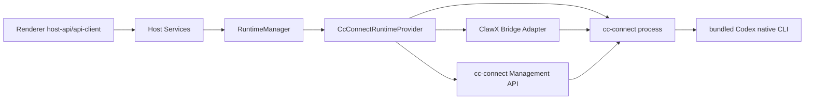

# cc-connect + Codex Core Replacement

## Status

Status: approved for implementation

This document upgrades the runtime abstraction work from "cc-connect is selectable" to "cc-connect + Codex can replace OpenClaw core GUI functionality." OpenClaw remains the fallback runtime, but cc-connect mode must no longer be a mostly unsupported stub.

## Goal

When `cc-connect` is selected as the runtime, ClawX should provide a working core loop without OpenClaw Gateway:

- GUI chat sends prompts through cc-connect BridgePlatform to the Codex project agent.
- Sessions and history are exposed through the cc-connect bridge adapter under ClawX-managed app data.
- Runtime status, logs, and Doctor are runtime-aware.
- Provider, cron, and channel surfaces degrade through cc-connect capability checks instead of writing OpenClaw config.

## Accepted Architecture

ClawX uses cc-connect as the replacement provider:

- cc-connect owns the GUI BridgePlatform connection, provider/cron integration, Doctor, managed config, logs, and packaged binary lifecycle.
- ClawX bundles the native OpenAI Codex CLI and writes it into the cc-connect project config as the Codex agent command.
- ClawX converts supported provider/model settings into a managed Codex launch profile for cc-connect mode.
- `RuntimeManager` remains the boundary exposed to host services.



## GUI Chat Through cc-connect

ClawX registers a local `clawx` BridgePlatform adapter over cc-connect WebSocket bridge. GUI messages are sent as bridge `message` packets, cc-connect runs the configured Codex project agent, and replies are converted back into the existing `chat:message` and `chat:runtime-event` host events.

## Core Capability Contract

| Capability | Replacement behavior |
|---|---|
| Chat | `CcConnectRuntimeProvider.sendMessageWithMedia` sends through the ClawX cc-connect BridgePlatform adapter. |
| Sessions | ClawX exposes bridge-backed cc-connect/Codex sessions under app userData. |
| History | ClawX returns `RawMessage[]` from the bridge adapter history. |
| Delete session | Deletes managed transcript and metadata. |
| Logs/status | Shows provider logs, Codex command logs, and cc-connect managed config hints. |
| Doctor | Runs cc-connect Doctor plus Codex CLI availability/version checks. |
| Providers/models | ClawX syncs the active provider account into `provider-profile.json` and cc-connect project config/env. |
| Cron | Host cron APIs route to cc-connect Management API when cc-connect runtime is active. |
| Skills | Enabled local skills are mirrored into managed `codex-home/skills`. |
| Channels | Channel-specific OpenClaw configuration remains unavailable in cc-connect mode. |

## Managed Paths

All cc-connect/Codex runtime state stays under:

```text
app.getPath('userData')/runtimes/cc-connect/
```

Subdirectories:

- `config.toml`
- `codex-sessions/`
- `codex-home/`
- `logs/`
- `provider-profile.json`

ClawX must not read or mutate user `~/.cc-connect` or rely on user `~/.codex` auth state for cc-connect mode.

## Provider And Model Conversion

The cc-connect runtime converts the active ClawX provider account into a Codex launch profile:

- OpenAI API key accounts: `codex exec --model <model>` with `OPENAI_API_KEY` in the child process environment.
- OpenAI OAuth browser accounts: `codex exec --model <model>` with `CODEX_HOME` pointing at `app userData/runtimes/cc-connect/codex-home/`. ClawX writes a managed Codex `auth.json` from the stored OpenAI OAuth access, refresh, optional ID token, and account id.
- Ollama local accounts: `codex exec --oss --local-provider ollama --model <model>`.
- Unsupported vendors return a stable unsupported error before spawning Codex and do not mutate OpenClaw configuration.
- Codex child processes inherit ClawX proxy settings as `HTTP_PROXY`, `HTTPS_PROXY`, `ALL_PROXY`, and `NO_PROXY` environment variables, matching Gateway launch behavior.

`provider-profile.json` is intentionally public/diagnostic: it records provider id, model, args, and environment key names only. It must not contain API keys or OAuth token values.

## First Implementation Slice

The first replacement-grade slice implements:

- cc-connect process lifecycle with management and bridge enabled
- ClawX BridgePlatform adapter
- `sendMessageWithMedia`
- `listSessions`
- `loadHistory`
- `deleteSession`
- provider/model profile sync for OpenAI API key, OpenAI OAuth/Codex, and Ollama
- cron list/create/update/delete/trigger through cc-connect Management API
- skill mirroring into managed Codex home
- runtime logs that include Codex command attempts
- Doctor output that includes Codex CLI version

Channel deep integration remains visible in capability docs and follow-up gates, but the cc-connect runtime should no longer report chat/session/history/provider/model/cron/skills as unsupported.

Current implemented capability flags for cc-connect mode:

- `chat`: supported through cc-connect BridgePlatform
- `sessions`: supported through the ClawX bridge adapter
- `history`: supported through the ClawX bridge adapter
- `providers`: supported for OpenAI API key, OpenAI OAuth/Codex, and Ollama via managed Codex launch profile
- `models`: supported for OpenAI/Codex and Ollama via `codex exec --model` or `--oss --local-provider ollama`
- `logs`: supported through managed config/session path output
- `doctor`: supported through cc-connect Doctor plus Codex CLI diagnostics
- `cron`: supported through cc-connect Management API
- `skills`: supported through managed Codex home mirroring
- `channels`, `controlUi`: not yet marked supported in the runtime capability matrix

## Acceptance

- Unit tests prove `cc-connect` runtime starts a managed cc-connect process and sends through the ClawX bridge adapter.
- Unit tests prove sessions/history/delete operate from managed storage.
- Unit tests prove Doctor includes Codex CLI diagnostics.
- Unit tests prove OpenAI and Ollama provider accounts convert to Codex launch profiles without writing secrets to disk.
- Unit tests prove cc-connect/Codex child processes inherit ClawX proxy environment values.
- E2E tests prove a ClawX-managed cc-connect runtime can start from Settings-seeded config, write managed `config.toml`, send a real UI chat through the Codex bridge, and read back managed history through Host API.
- E2E tests prove the managed config points cc-connect at the bundled Codex binary and enables the bridge.
- Typecheck passes.
- Existing runtime abstraction tests still pass.
- Comms replay/compare remains required before PR or merge because chat routing changed.

## Rollback

- Switch runtime back to OpenClaw in Settings.
- Stop cc-connect runtime.
- Managed cc-connect/Codex session files remain under app userData and are not deleted automatically.
