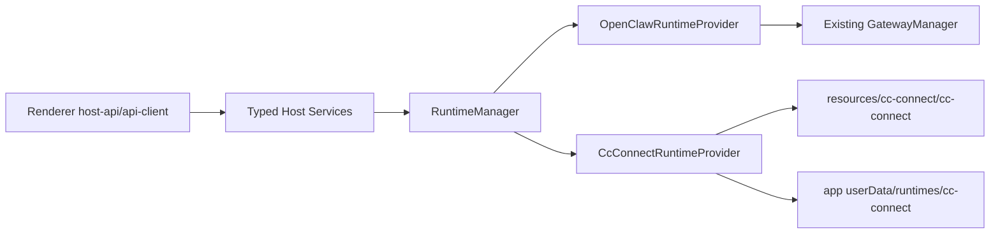

# ClawX Runtime Abstraction and cc-connect Migration Plan

## Background

ClawX currently treats OpenClaw Gateway as the only runtime. That keeps the renderer and host services simple, but it also means OpenClaw runtime instability directly affects chat, sessions, channels, cron, diagnostics, and packaging. ClawX needs a replaceable runtime layer so OpenClaw can remain the default and rollback path while cc-connect can be evaluated as an optional runtime.

## Goals

- Support `openclaw` and `cc-connect` behind one runtime contract.
- Keep `openclaw` as the default runtime.
- Add a Settings runtime selector with status, managed config path, and capability visibility.
- Run cc-connect from ClawX-managed app data, not the user's `~/.cc-connect`.
- Bundle cc-connect and native OpenAI Codex CLI binaries into packaged app resources so runtime startup does not require global installs, PATH binaries, or network downloads.
- Keep existing renderer entry points through `host-api` and the legacy `gateway:*` compatibility layer.

## Non-goals

- The first cc-connect release does not need strict parity for OpenClaw Skills or ClawHub integration.
- The first cc-connect release does not need to repair OpenClaw internal configuration.
- This plan does not remove `GatewayManager`; it wraps it as the OpenClaw provider first.

## cc-connect Facts

- `cc-connect@1.3.2` currently ships an npm package containing a CLI wrapper, `install.js`, `run.js`, `package.json`, and README.
- `install.js` downloads a GitHub or Gitee release binary into `node_modules/cc-connect/bin/`.
- Therefore ClawX packaging cannot rely on declaring the npm dependency alone. The build must explicitly download, verify, and copy the target platform binary into Electron `extraResources`.
- Runtime startup must execute the bundled resource binary in packaged builds.

## Capability Matrix

| Capability | OpenClaw | cc-connect first version | Behavior when unsupported |
| --- | --- | --- | --- |
| Chat | Supported | Adapter-dependent | Stable unsupported error |
| Sessions | Supported | Adapter-dependent | Empty/stable response or unsupported |
| History | Supported | Adapter-dependent | Empty/stable response or unsupported |
| Providers/models | Supported | OpenAI API key, OpenAI OAuth/Codex, and Ollama supported through Codex launch profile | Unsupported providers return stable errors and do not mutate OpenClaw config |
| Channels | Supported | Adapter-dependent | Capability-aware degradation |
| Cron | Supported | Not first-version parity | Disabled or stable unsupported |
| Logs/status | Supported | Supported through process logs/status | Runtime manager log/status surface |
| Skills | Supported | Not supported initially | OpenClaw-only controls hidden or disabled |
| Doctor | Supported | `doctor user-isolation` supported; fix unavailable in 1.3.2 | Runtime-aware doctor output; fix disabled for cc-connect |

## Architecture

The host process owns runtime selection and process lifecycle.



### Runtime Contract

- `RuntimeKind = 'openclaw' | 'cc-connect'`
- `RuntimeStatus` extends the existing gateway status semantics and adds:
  - `runtimeKind`
  - `capabilities`
  - `configDir`
- `RuntimeProvider` exposes:
  - `start`
  - `stop`
  - `restart`
  - `getStatus`
  - `checkHealth`
  - `rpc`
  - `sendMessageWithMedia`
  - `listSessions`
  - `loadHistory`
  - `deleteSession`
  - `listLogs`
  - `listCapabilities`

### Provider Ownership

- `OpenClawRuntimeProvider` wraps the existing `GatewayManager`. OpenClaw behavior stays the default and the rollback path.
- `CcConnectRuntimeProvider` owns:
  - binary path resolution
  - managed config creation
  - process lifecycle
  - stdout/stderr capture
  - `doctor user-isolation` execution against the managed config
  - provider/model profile sync for supported Codex launch modes
  - managed `CODEX_HOME` creation for OpenAI OAuth so cc-connect mode does not depend on user `~/.codex`
  - stable unsupported responses for missing capabilities
- `HostApiContext` and typed host services use `RuntimeManager`. Legacy `gateway:*` IPC and events remain available for compatibility.

OpenClaw-specific logic remains scoped to the OpenClaw path:

- `openclaw-auth`
- `openclaw-proxy`
- OpenClaw Doctor
- OpenClaw Skills
- OpenClaw Control UI
- OpenClaw config repair

Provider, agent, channel, and cron routes should be migrated capability-by-capability. They must not assume `~/.openclaw` when the active runtime is not OpenClaw.

## cc-connect Managed Runtime

ClawX owns cc-connect state under:

```text
app.getPath('userData')/runtimes/cc-connect/
```

The first managed files are:

- `config.toml`
- `provider-profile.json`
- `codex-sessions/`
- runtime logs
- runtime working directory

ClawX must not read or mutate `~/.cc-connect` automatically.

## Packaging Design

`cc-connect` and `@openai/codex` are `devDependency` entries because the packaged runtime executes verified bundle artifacts from `extraResources`, not from asar `node_modules` or global installs.

`scripts/bundle-cc-connect.mjs`:

- Reads `cc-connect/package.json` version.
- Resolves release assets named `cc-connect-v${version}-${platform}-${arch}`.
- Supports:
  - `darwin-x64`
  - `darwin-arm64`
  - `linux-x64`
  - `linux-arm64`
  - `win32-x64`
- Downloads from release sources during build.
- Extracts to `build/cc-connect/<platform>-<arch>/cc-connect[.exe]`.
- Runs `--version` and requires the expected version.
- Writes `manifest.json` containing version, platform, arch, source URL, and SHA-256 integrity.
- Applies executable permissions on POSIX binaries.

`electron-builder.yml` copies the prepared platform directory to:

```text
process.resourcesPath/cc-connect/
process.resourcesPath/codex/
```

The binary is intentionally outside asar so it remains executable.

## Runtime Path Resolution

- Development: use `build/cc-connect/<platform>-<arch>/cc-connect[.exe]` and `build/codex/<platform>-<arch>/bin/codex[.exe]`.
- Packaged: use `process.resourcesPath/cc-connect/cc-connect[.exe]` and `process.resourcesPath/codex/bin/codex[.exe]`.
- If a binary is missing, the provider reports a clear startup error instructing developers to run the matching bundle script.

## Migration Plan

1. Introduce shared runtime types and `RuntimeManager`.
2. Wrap existing `GatewayManager` with `OpenClawRuntimeProvider`.
3. Add `CcConnectRuntimeProvider` with managed config and binary lifecycle.
4. Move host gateway status/start/stop/restart/health/rpc/chat/session paths through `RuntimeManager`.
5. Add Settings runtime selector and capability-aware UI.
6. Add cc-connect bundling scripts and electron-builder resources.
7. Add tests and harness coverage.
8. Update README files and developer docs.
9. Continue migrating provider/channel/cron/skills routes to capability dispatch.

The replacement-grade follow-up is documented in
`docs/cc-connect-codex-core-replacement.md`. That slice makes cc-connect runtime
mode use a ClawX BridgePlatform adapter for GUI chat, sessions, history, cron,
skills, and supported provider/model selection so the core chat loop no longer
depends on OpenClaw Gateway.

## Rollback Strategy

- Switch Settings runtime back to OpenClaw.
- Stop the cc-connect process.
- Keep the managed cc-connect config directory intact for future reuse.
- OpenClaw remains the default runtime and the release rollback path.

## Test Plan

- Unit:
  - `RuntimeManager` default selection, switching, fallback, and event forwarding.
	  - `OpenClawRuntimeProvider` preserves Gateway behavior.
	  - `CcConnectRuntimeProvider` mock binary startup, stop, crash, config path, provider profile, and logs.
	  - cc-connect provider profile conversion for OpenAI/Codex, Ollama, and unsupported providers.
  - cc-connect bundler URL mapping, manifest generation, version mismatch, and failure cases.
- Integration:
  - Host API returns stable envelopes in both runtimes.
	  - Unsupported provider/channel/cron operations do not mutate OpenClaw config.
	  - Provider API sync uses cc-connect runtime profile when cc-connect is active.
- E2E:
  - Settings runtime selector.
  - OpenClaw default smoke.
	  - cc-connect mock runtime chat smoke, including provider/model args for Codex.
  - OpenClaw-only controls unavailable in cc-connect mode.
- Packaging:
  - `pnpm run package:mac:local` then verify `release/mac-arm64/ClawX.app/Contents/Resources/cc-connect/cc-connect --version`.
  - Windows/Linux CI checks `resources/cc-connect/cc-connect[.exe]`.
  - Because this touches communication paths, run `pnpm run comms:replay` and `pnpm run comms:compare`.

## Assumptions

- OpenClaw remains the default runtime.
- First-version cc-connect acceptance is core-equivalent for chat, sessions, history, providers/models, cron, and skills, not full OpenClaw-specific parity.
- ClawX manages cc-connect config and does not modify `~/.cc-connect`.
- Packaged ClawX must run cc-connect and Codex offline without global install or runtime download.
