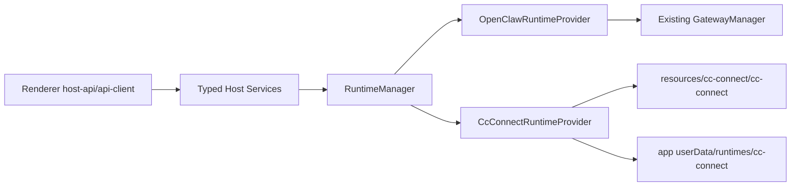

# ClawX Runtime Abstraction and cc-connect Migration Plan

## Background

ClawX currently treats OpenClaw Gateway as the only runtime. That keeps the renderer and host services simple, but it also means OpenClaw runtime instability directly affects chat, sessions, channels, cron, diagnostics, and packaging. ClawX needs a replaceable runtime layer so OpenClaw can remain the default and rollback path while cc-connect can be evaluated as an optional runtime.

## Goals

- Support `openclaw` and `cc-connect` behind one runtime contract.
- Keep `openclaw` as the default runtime.
- Add a Settings runtime selector with status, managed config path, and capability visibility.
- Run cc-connect from ClawX-managed app data, not the user's `~/.cc-connect`.
- Bundle cc-connect and native OpenAI Codex CLI binaries into packaged app resources so runtime startup does not require global installs, PATH binaries, or network downloads.
- Keep existing renderer entry points through `host-api` and the legacy `gateway:*` compatibility layer.

## Non-goals

- The first cc-connect release does not need strict parity for OpenClaw Skills or ClawHub integration.
- The first cc-connect release does not need to repair OpenClaw internal configuration.
- This plan does not remove `GatewayManager`; it wraps it as the OpenClaw provider first.

## cc-connect Facts

- `cc-connect@1.3.2` currently ships an npm package containing a CLI wrapper, `install.js`, `run.js`, `package.json`, and README.
- `install.js` downloads a GitHub or Gitee release binary into `node_modules/cc-connect/bin/`.
- Therefore ClawX packaging cannot rely on declaring the npm dependency alone. The build must explicitly download, verify, and copy the target platform binary into Electron `extraResources`.
- Runtime startup must execute the bundled resource binary in packaged builds.

## Capability Matrix

| Capability | OpenClaw | cc-connect first version | Behavior when unsupported |
| --- | --- | --- | --- |
| Chat | Supported, including abort | Supported through BridgePlatform and Codex; abort still a gap | Stable unsupported error or runtime `aborted` event once implemented |
| Sessions | Supported | Supported through bridge state plus Codex transcript fallback; real-runtime reload/delete still needs parity validation | Empty/stable response or unsupported |
| History | Supported | Supported through bridge state plus Codex transcript fallback; token/cost history still needs validation | Empty/stable response or unsupported |
| Providers/models | Supported | OpenAI API key, OpenAI OAuth/Codex, OpenAI-compatible Responses Custom providers, and Ollama supported through Codex launch profile | Chat Completions Custom providers and unsupported vendors return stable errors and do not mutate OpenClaw config |
| Channels | Supported | cc-connect platform bridges with runtime-routed status probes; live connect/disconnect/delete are not parity yet | Capability-aware degradation |
| Cron | Supported | Management API-backed list/create/update/delete/run; toggle maps to update and needs real API validation | Disabled or stable unsupported |
| Logs/status | Supported | Supported through process logs/status | Runtime manager log/status surface |
| Skills | Supported | Enabled local skills mirrored into managed Codex home; OpenClaw Skills/ClawHub parity is not strict | OpenClaw-only controls hidden or disabled |
| Doctor | Supported | `doctor user-isolation` supported; fix unavailable in 1.3.2 | Runtime-aware doctor output; fix disabled for cc-connect |

## Replacement Readiness Gap Register

This section tracks the gap between "cc-connect can run ClawX chat" and
"cc-connect + Codex can replace OpenClaw for core ClawX workflows." It is a
living backlog for the next delivery phases.

### Current verified baseline

- Local dev can bundle and verify `cc-connect@1.3.2` and `@openai/codex@0.137.0`.
- Mock bridge E2E covers Settings runtime switching, managed config creation,
  cc-connect BridgePlatform chat, OpenAI OAuth profile materialization, sessions/history,
  channels, cron, and skills sync behavior.
- Real bundle smoke starts the packaged development `cc-connect` and `codex`
  binaries without replacing them with mock executables.
- Opt-in real OAuth E2E verifies ClawX chat box delivery through real
  cc-connect, real bundled Codex, and a developer-supplied isolated
  `CODEX_HOME/auth.json` with `auth_mode: chatgpt`.

### P0 gaps before treating cc-connect as a real OpenClaw replacement

1. Capability accuracy.
   - `RuntimeCapabilities` is currently boolean and too coarse. cc-connect can
     report `chat`, `channels`, `cron`, or `doctor` as supported while important
     sub-operations are still unsupported.
   - The replacement contract needs operation-level support such as
     `chat.send`, `chat.abort`, `doctor.run`, `doctor.fix`,
     `channels.status`, `channels.connect`, `cron.update`, and `cron.toggle`.
   - UI badges must show degraded/native/unsupported states instead of implying
     full parity from one capability boolean.
2. In-app Codex OAuth lifecycle.
   - Real OAuth is verified only after a developer manually runs bundled
     `codex login` against the ClawX-managed `CODEX_HOME`.
   - ClawX still needs a Settings flow for Codex login, login status, logout,
     relogin, auth expiry, and copyable diagnostic paths.
   - The flow must keep tokens inside app userData and must not silently import
     or mutate user `~/.codex` unless the user explicitly chooses migration.
3. Chat stop/abort parity.
   - OpenClaw has a first-class abort path. cc-connect BridgePlatform does not
     currently expose a stable abort RPC in ClawX.
   - Stop must either map to a real cc-connect/Codex cancellation primitive or
     terminate the active child process and emit the same `aborted` runtime
     event shape that the renderer expects.
4. Doctor parity.
   - `cc-connect --help` does not list doctor, but `cc-connect doctor` reveals a
     hidden `user-isolation` subcommand.
   - ClawX currently maps `doctor.run` to `doctor user-isolation` and returns a
     stable unsupported result for `doctor.fix`.
   - Because cc-connect doctor is not the same feature as OpenClaw Doctor, the
     UI and contract must distinguish cc-connect isolation diagnostics, Codex
     diagnostics, and OpenClaw config repair.
5. Developer-only runtime gate.
   - The renderer settings store currently forces `runtimeKind` back to
     `openclaw` when Developer Mode is not unlocked.
   - That is acceptable for an experimental runtime, but it blocks treating
     cc-connect as a production replacement. A release decision is needed for
     when the selector becomes generally available.

### P1 gaps for core workflow equivalence

1. Provider/model conversion matrix.
   - Current conversion covers OpenAI API key, OpenAI OAuth/Codex, Ollama,
     OpenAI-compatible Responses custom providers, and ByteDance ModelHub
     Responses specifics.
   - The matrix still needs production validation for unsupported vendor UX,
     Chat Completions custom providers, provider default-model fallback,
     reasoning effort, `env_http_headers`, API key availability, and model
     switching after runtime start.
   - cc-connect also has provider CLI/Web Admin concepts such as global
     providers, provider presets, project provider activation, and project model
     updates. ClawX currently writes a managed Codex launch profile instead of
     fully adopting the cc-connect provider management API, so this must be an
     explicit product decision.
2. Session/history fidelity.
   - The bridge adapter combines in-memory ClawX messages, cc-connect persisted
     session stores, and Codex transcript JSONL fallback.
   - This needs real-runtime validation for restart reload, named sessions,
     cross-agent sessions, delete semantics, transcript matching by
     `agent_session_id` and `work_dir`, and parity with OpenClaw sidebar titles.
   - Token/cost history is still OpenClaw-transcript-oriented and must be
     validated against Codex transcript usage records before the Dashboard can
     claim parity.
3. Tool events and artifacts.
   - The bridge currently handles text replies, streaming text, cards, buttons,
     and errors. cc-connect BridgePlatform also defines image, file, audio,
     preview update, and delete-message packets.
   - ClawX must validate tool-call rendering, generated files, image/file
     send-back, media attachments, and artifact panel behavior from real Codex
     transcripts and bridge packets.
4. Channel lifecycle.
   - Channel status is runtime-routed and ClawX materializes configured
     OpenClaw channel accounts into cc-connect project platform blocks.
   - `channels.connect`, `channels.disconnect`, and `channels.delete` are still
     config-driven instead of live cc-connect operations.
   - Each supported platform requires field mapping and real credential/status
     smoke tests, especially Feishu/Lark setup, Weixin/WeCom, Discord, Slack,
     Telegram, QQ, and LINE.
5. Cron and heartbeat.
   - cc-connect exposes CLI and Management API support for cron add/list/edit,
     delete, and immediate execution.
   - ClawX maps create/update/delete/run through Management API, but toggle is
     represented as update and needs UI/API parity tests.
   - Session mode, timeout, mute/silent, disabled manual run, project routing,
     and cc-connect heartbeat are not yet covered by ClawX acceptance.
6. Skills and commands.
   - ClawX mirrors enabled local skills into the managed Codex home.
   - cc-connect also has slash-command/custom-command behavior and setup prompts
     such as `/bind setup` or `/cron setup` for attachment send-back. These are
     not yet modeled in ClawX's Skills page or runtime capability contract.
7. Logs and diagnostics.
   - `listLogs` currently returns the managed config and paths with redaction,
     but not a unified diagnostic bundle.
   - A usable replacement needs one diagnostics view for cc-connect stdout/stderr,
     bridge state, Management API state, Codex doctor, OAuth status, config path,
     bundle versions, and last runtime error.
8. Lifecycle and port ownership.
   - cc-connect Management API and BridgePlatform use fixed local ports by
     default in the current adapter.
   - Replacement readiness requires collision handling, restart-after-crash
     behavior, process-tree cleanup on app quit, and no orphan `cc-connect` or
     `codex` child processes after runtime switching.
9. Packaged app validation.
   - Bundle verification is not the same as packaged app verification.
   - macOS must validate the final `.app/Contents/Resources/cc-connect` and
     `.app/Contents/Resources/codex` executables after `package:mac:local`.
   - Windows and Linux CI need equivalent resource-path, executable, and version
     checks.
10. Documentation and i18n.
   - Some user-facing text still says OpenClaw Doctor even when the active
     runtime is cc-connect.
   - README files describe cc-connect functionality optimistically; they need to
     distinguish experimental, degraded, and replacement-ready states.
11. Product-wide OpenClaw assumptions.
   - Setup still validates the embedded OpenClaw package as the runtime
     prerequisite. A cc-connect replacement track needs either a runtime-neutral
     setup check or an explicit "OpenClaw runtime installed for rollback" label.
   - Skills UI still presents OpenClaw source names and opens
     `hostApi.openclaw.getSkillsDir()`. cc-connect skills mirroring works, but
     the product surface does not yet show the managed Codex skills root or
     mirror status as a runtime-specific target.
   - File/media APIs still assume OpenClaw media roots such as
     `~/.openclaw/media/outbound` and `~/.openclaw/media/outgoing/records`.
     Generated artifact delivery under cc-connect needs its own media root and
     relay contract.
   - Proxy settings intentionally sync to OpenClaw Telegram config today. In
     cc-connect mode, platform proxy behavior needs a cc-connect config sync
     path instead of OpenClaw-only mutation.
   - Dreams and OpenClaw memory doctor routes are correctly OpenClaw-specific,
     but their navigation, fallback errors, and route availability must stay
     runtime-aware.
   - Channel store actions still call `channels.connect`,
     `channels.disconnect`, and `channels.delete`; the cc-connect provider
     currently treats those lifecycle operations as config refresh/restart
     concerns rather than live operations.

### External cc-connect facts to re-check per upgrade

The pinned local binary is the release contract. Upstream `main` documentation
can be newer than `cc-connect@1.3.2`, so every cc-connect version bump must
re-run this audit.

- BridgePlatform is documented as a WebSocket adapter interface with
  authenticated `register`, `message`, `reply`, `reply_stream`, card/button,
  image/file/audio, and preview/delete-message packets.
  Source: <https://github.com/chenhg5/cc-connect/blob/main/docs/bridge-protocol.md>
- Management API is documented as a token-authenticated HTTP API for GUI and
  local management tools, including projects, sessions, providers, models, cron,
  heartbeat, and bridge adapters.
  Source: <https://github.com/chenhg5/cc-connect/blob/main/docs/management-api.md>
- `doctor user-isolation` runs preflight and isolation checks for `run_as_user`
  projects and writes audit output; this is not equivalent to OpenClaw config
  repair.
  Source: <https://github.com/chenhg5/cc-connect/blob/main/docs/usage.md>
- `cc-connect send --image/--file` and the related setup prompts are relevant
  for generated artifact delivery, but ClawX GUI chat currently needs separate
  validation before relying on that path.
  Source: <https://github.com/chenhg5/cc-connect/blob/main/docs/usage.md>

### Missing validation conditions

The replacement track must keep these validation conditions visible until they
are covered by automated tests or an explicit release exception.

| Area | Current evidence | Missing condition | Required validation |
| --- | --- | --- | --- |
| Runtime contract | `RuntimeStatus.capabilities` and `operationCapabilities` expose top-level and RPC-level support | UI/host callers still need to consume operation-level support before invoking unsupported actions | Unit test for RPC contract, Settings E2E for operation gaps, and page-level tests for disabled unsupported actions |
| Chat send | Mock bridge E2E and opt-in real OAuth E2E prove basic chat delivery | Multi-turn tool-heavy conversations, generated files, media attachments, network retry, model errors, and long-running tasks | Mock bridge event E2E plus gated real Codex prompt suite |
| Chat abort | `chat.abort` is explicitly unsupported for cc-connect | Stop button must cancel/kill active Codex work and emit `aborted` parity events | Unit test around active run cancellation and E2E stop-button smoke |
| Codex OAuth | Gated real OAuth E2E passes with pre-existing managed `CODEX_HOME/auth.json` | In-app login/status/logout/relogin and expired-token recovery | Host API unit tests plus manual/gated real OAuth E2E |
| Doctor | cc-connect `doctor user-isolation` and Codex `--version` diagnostics are used | Codex `doctor --json`, cc-connect hidden doctor contract, and fix-equivalent behavior | Unit tests with mock doctor output plus real binary doctor smoke |
| Provider/model | Unit coverage for OpenAI, OAuth, custom Responses, ModelHub, Ollama, unsupported vendors | Runtime switching after provider changes, Web Admin/provider API alignment, custom header behavior, model defaults | Unit matrix plus real bundle startup for each provider mode that can run without secrets |
| Sessions/history | Bridge and transcript parsing unit/E2E coverage | Restart reload, cross-agent isolation, delete semantics, title parity, token/cost usage history | Real cc-connect session store fixture and E2E restart/delete smoke |
| Channels | Config projection and status probes are mocked | Real platform credential field mapping and live lifecycle semantics | Per-platform fixture tests plus at least one real sandbox channel smoke |
| Cron | Management API paths are implemented and mocked | Real cc-connect cron add/list/edit/info/del/exec mapping, enabled/toggle, session mode, timeout, silent/mute | Real management API smoke with mock agent project |
| Skills/commands | Enabled local skills mirror into managed Codex home | ClawX Skills page must show mirror target/status and command/slash behavior must be validated | Unit sync test plus UI state test |
| Logs/diagnostics | `listLogs` redacts config paths and managed config | Unified diagnostic bundle with stdout/stderr, bridge state, Codex doctor, OAuth status, versions, config paths | Host API test plus Settings diagnostics E2E |
| Lifecycle | Runtime start/stop/restart unit and E2E smoke | Port collisions, crash recovery, process tree cleanup, rollback to OpenClaw, app quit cleanup | Unit process tests and E2E runtime switch/quit smoke |
| Packaging | Bundle verification and real bundle smoke | Final packaged `.app`/Windows/Linux resource path, executable bit, version output, codesign/notarization interaction | `package:mac:local` smoke and CI matrix artifact checks |

## Architecture

The host process owns runtime selection and process lifecycle.



### Runtime Contract

- `RuntimeKind = 'openclaw' | 'cc-connect'`
- `RuntimeStatus` extends the existing gateway status semantics and adds:
  - `runtimeKind`
  - `capabilities`
  - `operationCapabilities`
  - `configDir`
- `RuntimeProvider` exposes:
  - `start`
  - `stop`
  - `restart`
  - `getStatus`
  - `checkHealth`
  - `rpc`
  - `sendMessageWithMedia`
  - `listSessions`
  - `loadHistory`
  - `deleteSession`
  - `listLogs`
  - `listCapabilities`
  - `listOperationCapabilities`

### Provider Ownership

- `OpenClawRuntimeProvider` wraps the existing `GatewayManager`. OpenClaw behavior stays the default and the rollback path.
- `CcConnectRuntimeProvider` owns:
  - binary path resolution
  - managed config creation
  - process lifecycle
  - stdout/stderr capture
  - `doctor user-isolation` execution against the managed config
  - provider/model profile sync for supported Codex launch modes
  - managed `CODEX_HOME` creation for OpenAI OAuth so cc-connect mode does not depend on user `~/.codex`
  - Codex OAuth mode where a pre-existing ClawX-managed `CODEX_HOME/auth.json` is used before any legacy token import from user `~/.codex`
  - stable unsupported responses for missing capabilities
- `HostApiContext` and typed host services use `RuntimeManager`. Legacy `gateway:*` IPC and events remain available for compatibility.

OpenClaw-specific logic remains scoped to the OpenClaw path:

- `openclaw-auth`
- `openclaw-proxy`
- OpenClaw Doctor
- OpenClaw Skills
- OpenClaw Control UI
- OpenClaw config repair

When `cc-connect` is active, the same typed `gateway.controlUi` host route opens cc-connect Web Admin instead of OpenClaw Control UI.

Provider, agent, channel, and cron routes should be migrated capability-by-capability. They must not assume `~/.openclaw` when the active runtime is not OpenClaw.

## cc-connect Managed Runtime

ClawX owns cc-connect state under:

```text
app.getPath('userData')/runtimes/cc-connect/
```

The first managed files are:

- `config.toml`
- `provider-profile.json`
- `data/sessions/`
- `codex-home/`
- `workspaces/<agent-id>/`
- runtime logs
- runtime working directory

ClawX must not read or mutate `~/.cc-connect` automatically.

Workspace selection is compatibility-first:

- Explicit ClawX overrides such as `CLAWX_CODEX_WORKDIR` or a provider-supplied
  runtime `workDir` win.
- If the OpenClaw agent config points at an existing workspace directory, the
  cc-connect runtime reuses that workspace for the matching agent so existing
  user files and project context continue to work after switching runtimes.
- If no configured OpenClaw workspace exists, ClawX creates and uses
  `app.getPath('userData')/runtimes/cc-connect/workspaces/<agent-id>/`.
- ClawX does not default to the ClawX source checkout or to `process.cwd()` as a
  runtime workspace.

## Packaging Design

`cc-connect` and `@openai/codex` are `devDependency` entries because the packaged runtime executes verified bundle artifacts from `extraResources`, not from asar `node_modules` or global installs.

`scripts/bundle-cc-connect.mjs`:

- Reads `cc-connect/package.json` version.
- Resolves release assets named `cc-connect-v${version}-${platform}-${arch}`.
- Supports:
  - `darwin-x64`
  - `darwin-arm64`
  - `linux-x64`
  - `linux-arm64`
  - `win32-x64`
- Downloads from release sources during build.
- Extracts to `build/cc-connect/<platform>-<arch>/cc-connect[.exe]`.
- Runs `--version` and requires the expected version.
- Writes `manifest.json` containing version, platform, arch, source URL, and SHA-256 integrity.
- Applies executable permissions on POSIX binaries.

`electron-builder.yml` copies the prepared platform directory to:

```text
process.resourcesPath/cc-connect/
process.resourcesPath/codex/
```

The binary is intentionally outside asar so it remains executable.

## Runtime Path Resolution

- Development: use `build/cc-connect/<platform>-<arch>/cc-connect[.exe]` and `build/codex/<platform>-<arch>/bin/codex[.exe]`.
- Packaged: use `process.resourcesPath/cc-connect/cc-connect[.exe]` and `process.resourcesPath/codex/bin/codex[.exe]`.
- If a binary is missing, the provider reports a clear startup error instructing developers to run the matching bundle script.

## Migration Plan

1. Introduce shared runtime types and `RuntimeManager`.
2. Wrap existing `GatewayManager` with `OpenClawRuntimeProvider`.
3. Add `CcConnectRuntimeProvider` with managed config and binary lifecycle.
4. Move host gateway status/start/stop/restart/health/rpc/chat/session paths through `RuntimeManager`.
5. Add Settings runtime selector and capability-aware UI.
6. Add cc-connect bundling scripts and electron-builder resources.
7. Add tests and harness coverage.
8. Update README files and developer docs.
9. Continue migrating provider/channel/cron/skills routes to capability dispatch.

cc-connect runtime mode sends GUI chat through the ClawX BridgePlatform adapter
into cc-connect. cc-connect then invokes the configured Codex project agent.
Sessions, history, cron, skills, and supported provider/model selection stay
behind the same runtime layer so the core chat loop can run without depending on
OpenClaw Gateway.

## Rollback Strategy

- Switch Settings runtime back to OpenClaw.
- Stop the cc-connect process.
- Keep the managed cc-connect config directory intact for future reuse.
- OpenClaw remains the default runtime and the release rollback path.

## Test Plan

- Unit:
  - `RuntimeManager` default selection, switching, fallback, and event forwarding.
	  - `OpenClawRuntimeProvider` preserves Gateway behavior.
	  - `CcConnectRuntimeProvider` mock binary startup, stop, crash, config path, provider profile, and logs.
	  - cc-connect provider profile conversion for OpenAI/Codex, OpenAI-compatible Responses Custom providers, Ollama, and unsupported providers.
  - cc-connect bundler URL mapping, manifest generation, version mismatch, and failure cases.
- Integration:
  - Host API returns stable envelopes in both runtimes.
	  - Unsupported provider/cron operations do not mutate OpenClaw config, and channel status probes use the active runtime.
	  - Provider API sync uses cc-connect runtime profile when cc-connect is active.
- E2E:
  - Settings runtime selector.
  - OpenClaw default smoke.
	  - cc-connect mock runtime chat smoke, including provider/model args for Codex.
  - OpenClaw-only controls unavailable in cc-connect mode.
- Packaging:
  - `pnpm run package:mac:local` then verify `release/mac-arm64/ClawX.app/Contents/Resources/cc-connect/cc-connect --version`.
  - Windows/Linux CI checks `resources/cc-connect/cc-connect[.exe]`.
  - Because this touches communication paths, run `pnpm run comms:replay` and `pnpm run comms:compare`.

## Assumptions

- OpenClaw remains the default runtime.
- First-version cc-connect acceptance is core-equivalent for chat, sessions, history, providers/models, cron, and skills, not full OpenClaw-specific parity.
- ClawX manages cc-connect config and does not modify `~/.cc-connect`.
- Packaged ClawX must run cc-connect and Codex offline without global install or runtime download.
