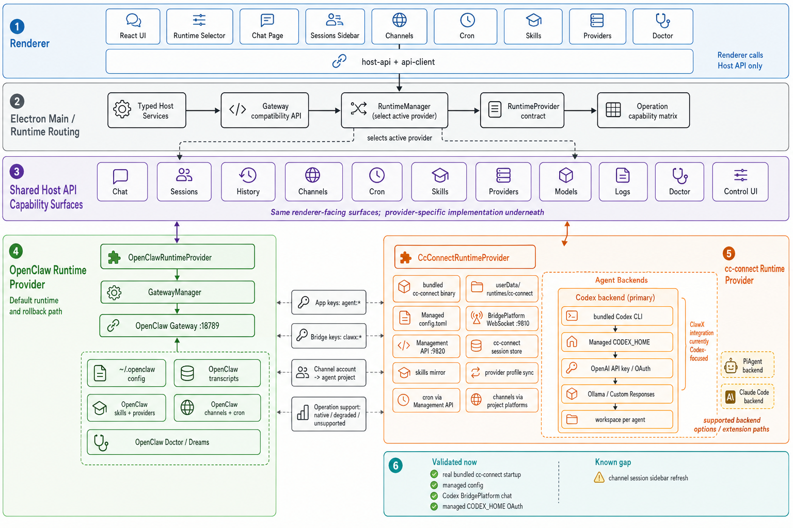

# ClawX Runtime Abstraction and cc-connect Migration Plan

## Background

ClawX currently treats OpenClaw Gateway as the only runtime. That keeps the renderer and host services simple, but it also means OpenClaw runtime instability directly affects chat, sessions, channels, cron, diagnostics, and packaging. ClawX needs a replaceable runtime layer so OpenClaw can remain the default and rollback path while cc-connect can be evaluated as an optional runtime.

## Goals

- Support `openclaw` and `cc-connect` behind one runtime contract.
- Keep `openclaw` as the default runtime.
- Add a Settings runtime selector with status, managed config path, and capability visibility.
- Run cc-connect from ClawX-managed app data, not the user's `~/.cc-connect`.
- Bundle cc-connect and native OpenAI Codex CLI binaries into packaged app resources so runtime startup does not require global installs, PATH binaries, or network downloads.
- Keep existing renderer entry points through `host-api` and the legacy `gateway:*` compatibility layer.

## Non-goals

- The first cc-connect release does not need strict parity for OpenClaw Skills or ClawHub integration.
- The first cc-connect release does not need to repair OpenClaw internal configuration.
- This plan does not remove `GatewayManager`; it wraps it as the OpenClaw provider first.

## cc-connect Facts

- `cc-connect@1.3.2` currently ships an npm package containing a CLI wrapper, `install.js`, `run.js`, `package.json`, and README.
- `install.js` downloads a GitHub or Gitee release binary into `node_modules/cc-connect/bin/`.
- Therefore ClawX packaging cannot rely on declaring the npm dependency alone. The build must explicitly download, verify, and copy the target platform binary into Electron `extraResources`.
- Runtime startup must execute the bundled resource binary in packaged builds.

## Capability Matrix

| Capability | OpenClaw | cc-connect first version | Behavior when unsupported |
| --- | --- | --- | --- |
| Chat | Supported, including abort | Supported through cc-connect BridgePlatform; cc-connect invokes Codex; text/streaming, tool/command/patch events, and image/file/audio bridge packets are mapped into the shared chat/runtime message model; abort marks the bridge run aborted and restarts cc-connect to terminate in-flight Codex work | Runtime `aborted` event plus restart-based cancellation |
| Sessions | Supported | Supported through cc-connect bridge/session store; real OAuth smoke covers restart reload and delete semantics for the main agent session | Empty/stable response or unsupported |
| History | Supported | Supported through cc-connect bridge/session store; token/cost history still needs field coverage validation | Empty/stable response or unsupported |
| Providers/models | Supported | OpenAI API key, OpenAI OAuth/Codex, OpenAI-compatible Responses Custom providers, and Ollama supported through Codex launch profile | Chat Completions Custom providers and unsupported vendors return stable errors and do not mutate OpenClaw config |
| Channels | Supported | cc-connect platform bridges with runtime-routed status probes; live connect/disconnect/delete are not parity yet | Capability-aware degradation |
| Cron | Supported | Management API-backed list/create/update/delete/toggle; prompt-job run falls back through BridgePlatform when the local cc-connect exec endpoint is unavailable | Stable unsupported for exec jobs when manual exec is not exposed |
| Logs/status | Supported | Supported through process logs/status | Runtime manager log/status surface |
| Skills | Supported | Enabled local skills mirrored into managed Codex home; OpenClaw Skills/ClawHub parity is not strict | OpenClaw-only controls hidden or disabled |
| Doctor | Supported | `doctor user-isolation` supported; fix unavailable in 1.3.2 | Runtime-aware doctor output; fix disabled for cc-connect |

## Replacement Readiness Gap Register

This section tracks the gap between "cc-connect can run ClawX chat" and
"cc-connect + Codex can replace OpenClaw for core ClawX workflows." It is a
living backlog for the next delivery phases.

### Current verified baseline

- Local dev can bundle and verify `cc-connect@1.3.2` and `@openai/codex@0.137.0`.
- Mock bridge E2E covers Settings runtime switching, managed config creation,
  cc-connect BridgePlatform chat, OpenAI OAuth profile materialization, sessions/history,
  channels, cron, and skills sync behavior.
- cc-connect session listing now carries transcript-derived `derivedTitle` and
  `lastMessagePreview` alongside channel/user `displayName`, so the shared
  Sessions surface can refresh sidebar labels from the same runtime API that
  OpenClaw uses.
- Real bundle smoke starts the packaged development `cc-connect` and `codex`
  binaries without replacing them with mock executables.
- Opt-in real OAuth E2E verifies ClawX chat delivery, session summary/history,
  managed project workspace isolation, local skill mirroring, and prompt cron
  create/list/run/toggle/delete through real cc-connect, real bundled Codex,
  and a ClawX-managed `CODEX_HOME/auth.json` with `auth_mode: chatgpt`.
- Provider Host API exposes cc-connect Codex OAuth status, explicit import from
  the user's local Codex OAuth file, and logout/secret cleanup without exposing
  OAuth token values to the renderer.
- Settings > AI Providers exposes the same cc-connect Codex OAuth lifecycle on
  OpenAI OAuth account cards: status refresh, managed path copy/open, explicit
  local import, relogin, manual callback submission, and logout.
- Runtime diagnostics are now runtime-aware. The diagnostics snapshot includes
  active runtime status, operation-level capabilities, cc-connect managed paths,
  Codex OAuth status, sanitized provider profile data, and the active runtime log
  tail, bundle manifests/version command output, and Management API health;
  Settings exposes a copyable runtime diagnostics bundle.
- File/media Host APIs now use runtime-aware media roots. OpenClaw staging and
  outgoing media records remain under `~/.openclaw/media`, while cc-connect
  staging and outgoing record resolution use ClawX-managed
  `userData/runtimes/cc-connect/media` with OpenClaw fallback for historical
  messages.
- The cc-connect BridgePlatform adapter now declares `image`, `file`, and
  `audio` capabilities and converts base64/path/url media packets into
  renderer-visible `_attachedFiles` messages stored under the cc-connect
  managed media directory.
- The cc-connect BridgePlatform adapter also declares tool/command/patch event
  support. Protocol-level fixtures map `tool_call`, `tool_result`,
  `command_output`, and `patch_completed` packets into the shared runtime graph,
  and file-editing tool calls are persisted as `toolCall` content blocks so the
  generated-files panel can use the same extraction path as OpenClaw/Codex
  transcripts.

### P0 gaps before treating cc-connect as a real OpenClaw replacement

1. Capability accuracy.
   - `RuntimeStatus.operationCapabilities` now exposes operation-level support
     such as `chat.send`, `chat.abort`, `doctor.run`, `doctor.fix`,
     `channels.status`, `channels.connect`, `cron.update`, and `cron.toggle`.
   - Settings consumes this metadata and shows degraded/native/unsupported
     operation gaps instead of implying full parity from one top-level boolean.
   - Cron and channel runtime actions now consult the operation contract before
     invoking runtime-specific actions. Cron list/create/update/delete/toggle/run
     and channel connect/disconnect/delete share the same renderer guard used by
     Settings Doctor Fix.
   - Remaining work is to expand real-runtime coverage for operation-specific
     edge cases rather than top-level capability visibility.
2. In-app Codex OAuth lifecycle.
   - Host API now supports Codex OAuth status, explicit import from
     user `~/.codex/auth.json`, and logout of the managed cc-connect Codex auth
     plus stored OAuth secret.
   - Settings UI now exposes status, managed path diagnostics, explicit import,
     relogin/manual callback, and logout for OpenAI OAuth accounts.
   - ClawX still needs expired-token recovery and a gated live relogin test that
     exercises the external browser OAuth path end to end.
   - The flow keeps runtime tokens inside app userData and only imports
     user `~/.codex` when the user or test explicitly requests migration.
3. Chat stop/abort parity.
   - OpenClaw has a first-class abort path. cc-connect BridgePlatform does not
     currently expose a stable single-run abort RPC.
   - ClawX now terminates the active bridge run locally, emits the same
     `aborted` runtime event shape that the renderer expects, ignores late
     bridge replies for that run, and restarts cc-connect to terminate in-flight
     Codex work.
   - This is complete for the current abstraction surface, but it remains
     coarser than an upstream cc-connect single-run cancellation primitive.
4. Doctor parity.
   - `cc-connect --help` does not list doctor, but `cc-connect doctor` reveals a
     hidden `user-isolation` subcommand.
   - ClawX currently maps `doctor.run` to `doctor user-isolation` and returns a
     stable unsupported result for `doctor.fix`.
   - Because cc-connect doctor is not the same feature as OpenClaw Doctor, the
     UI and contract must distinguish cc-connect isolation diagnostics, Codex
     diagnostics, and OpenClaw config repair. The runtime diagnostics snapshot
     now exposes the cc-connect side of this evidence, but OpenClaw Doctor Fix
     parity and Codex expired-auth repair remain separate unsatisfied items.
5. Developer-only runtime gate.
   - The renderer settings store currently forces `runtimeKind` back to
     `openclaw` when Developer Mode is not unlocked.
   - That is acceptable for an experimental runtime, but it blocks treating
     cc-connect as a production replacement. A release decision is needed for
     when the selector becomes generally available.

### P1 gaps for core workflow equivalence

1. Provider/model conversion matrix.
   - Current conversion covers OpenAI API key, OpenAI OAuth/Codex, Ollama,
     OpenAI-compatible Responses custom providers, and ByteDance ModelHub
     Responses specifics.
   - The matrix still needs production validation for unsupported vendor UX,
     Chat Completions custom providers, provider default-model fallback,
     reasoning effort, `env_http_headers`, API key availability, and model
     switching after runtime start.
   - cc-connect also has provider CLI/Web Admin concepts such as global
     providers, provider presets, project provider activation, and project model
     updates. ClawX currently writes a managed Codex launch profile instead of
     fully adopting the cc-connect provider management API, so this must be an
     explicit product decision.
2. Session/history fidelity.
   - The bridge adapter combines in-memory ClawX messages and cc-connect
     persisted session stores. It must not read Codex transcript JSONL files
     directly; missing history must be fixed in cc-connect BridgePlatform or
     cc-connect session store output.
   - Gated real OAuth smoke now validates main-agent session summary/history,
     runtime restart reload, and delete semantics through real cc-connect plus
     bundled Codex.
   - Remaining session parity work is named sessions, cross-agent isolation, and
     parity with OpenClaw sidebar title semantics.
   - Token/cost history now reads cc-connect-owned session store usage records
     under ClawX userData in addition to OpenClaw transcripts. It must not read
     Codex transcript JSONL files directly. Real-runtime usage field coverage
     still needs validation before the Dashboard can claim full parity.
3. Tool events and artifacts.
   - The bridge currently handles text replies, streaming text, preview updates,
     cards, buttons, errors, and image/file/audio media packets. Base64 media is
     persisted under the cc-connect managed media directory and surfaced through
     the shared `_attachedFiles` renderer model.
   - The bridge maps tool/command/patch packets into shared runtime events and
     stores file-editing tool calls as assistant `toolCall` content blocks, so
     execution graph and generated-file extraction no longer depend on
     OpenClaw-specific event names.
   - Remaining work is to validate generated artifact delivery, artifact panel
     behavior, and image/file send-back from real cc-connect bridge packets or
     session stores rather than only protocol-level fixtures.
4. Channel lifecycle.
   - Channel status is runtime-routed and ClawX materializes configured
     OpenClaw channel accounts into cc-connect project platform blocks.
   - `channels.connect`, `channels.disconnect`, and `channels.delete` are now
     wired through the cc-connect runtime provider as config refresh/restart
     operations. This matches the current managed-config model, but it is not a
     live per-platform connect/disconnect API.
   - Each supported platform requires field mapping and real credential/status
     smoke tests, especially Feishu/Lark setup, Weixin/WeCom, Discord, Slack,
     Telegram, QQ, and LINE.
5. Cron and heartbeat.
   - cc-connect exposes CLI and Management API support for cron add/list/edit,
     delete, and immediate execution.
   - ClawX maps create/update/delete/toggle through Management API. In the
     pinned local `cc-connect@1.3.2` binary, `POST /api/v1/cron/{id}/exec`
     returns `DELETE or PATCH only` even though upstream docs list it. ClawX
     therefore falls back to BridgePlatform delivery for prompt jobs and keeps
     exec jobs explicitly unsupported for manual run in this version.
   - Session mode, timeout, mute/silent edge cases, disabled manual run,
     cross-project routing, and cc-connect heartbeat are not yet covered by
     ClawX acceptance.
6. Skills and commands.
   - ClawX mirrors enabled local skills into the managed Codex home.
   - The Skills page now resolves a runtime-aware target. OpenClaw mode opens
     the source skills directory, while cc-connect mode displays and opens the
     managed Codex skills mirror root plus manifest path through Host API.
   - cc-connect also has slash-command/custom-command behavior and setup prompts
     such as `/bind setup` or `/cron setup` for attachment send-back. These are
     not yet modeled in ClawX's runtime capability contract.
7. Logs and diagnostics.
   - `listLogs` returns managed config and paths with redaction, and
     `diagnostics.gatewaySnapshot()` now includes active runtime status,
     operation capabilities, cc-connect managed paths, Codex OAuth summary,
     sanitized provider profile data, bundle manifests/version command output,
     Management API health, and runtime log tail.
   - Remaining replacement-readiness work is to add Codex doctor output and
     last structured runtime error classification into the same snapshot.
8. Lifecycle and port ownership.
   - cc-connect Management API and BridgePlatform prefer the documented local
     ports `9820` and `9810`, but ClawX now probes localhost before startup and
     writes fallback ports into the managed config when either default is busy.
     Runtime status, Control UI, diagnostics, and Management API calls all use
     the selected management port.
   - Unexpected cc-connect crashes now close the bridge, stop session polling,
     surface an error status, and schedule a bounded automatic restart instead
     of leaving the runtime permanently down.
   - Runtime stop/restart now starts cc-connect in its own process group on
     non-Windows platforms and terminates the process tree, so Codex child
     processes launched by cc-connect are cleaned up during runtime switching.
   - App quit already routes through `before-quit -> runtimeManager.stop()`,
     so the same cc-connect process-tree cleanup path is used during shutdown.
   - Real bundled-runtime Electron smoke now verifies app quit and rollback to
     OpenClaw close the cc-connect process, release the selected ports, and
     leave no process command referencing the isolated cc-connect runtime dir.
   - macOS dir-packaged smoke now starts `release/mac-arm64/ClawX.app` directly,
     verifies `Contents/Resources/cc-connect` and `Contents/Resources/codex`,
     starts cc-connect through the packaged resolver path, and checks cleanup
     after app quit.
   - Remaining release-readiness work is notarized dmg/zip validation and
     equivalent Windows/Linux packaged-runtime smoke coverage.
9. Packaged app validation.
   - Bundle verification is not the same as packaged app verification.
   - macOS dir-packaged smoke now validates the final
     `.app/Contents/Resources/cc-connect` and
     `.app/Contents/Resources/codex` executables, managed config `cmd`, runtime
     startup, and quit cleanup.
   - Remaining release-readiness work is notarized dmg/zip validation plus
     Windows and Linux resource-path, executable, startup, and cleanup smoke
     checks.
10. Documentation and i18n.
   - Some user-facing text still says OpenClaw Doctor even when the active
     runtime is cc-connect.
   - README files describe cc-connect functionality optimistically; they need to
     distinguish experimental, degraded, and replacement-ready states.
11. Product-wide OpenClaw assumptions.
   - Setup still validates the embedded OpenClaw package as the runtime
     prerequisite. A cc-connect replacement track needs either a runtime-neutral
     setup check or an explicit "OpenClaw runtime installed for rollback" label.
   - Skills UI now obtains its source and runtime mirror directories through
     `hostApi.skills.target()`, so cc-connect mode exposes the managed Codex
     skills root instead of opening the OpenClaw source directory. The remaining
     Skills gap is slash/custom-command behavior and setup prompts.
   - File/media staging and outgoing record lookup are runtime-aware for
     OpenClaw and cc-connect. Bridge tool/command/patch packets are translated
     into shared runtime events and generated-file `toolCall` blocks. Remaining
     work is validating generated artifact delivery and media relay packet
     semantics from real cc-connect bridge sessions.
   - Proxy settings intentionally sync to OpenClaw Telegram config today. In
     cc-connect mode, platform proxy behavior needs a cc-connect config sync
     path instead of OpenClaw-only mutation.
   - Dreams and OpenClaw memory doctor routes are correctly OpenClaw-specific,
     but their navigation, fallback errors, and route availability must stay
     runtime-aware.
   - Channel store actions can call `channels.connect`,
     `channels.disconnect`, and `channels.delete` through the runtime provider,
     but cc-connect mode treats them as config refresh/restart concerns rather
     than live platform operations.

### External cc-connect facts to re-check per upgrade

The pinned local binary is the release contract. Upstream `main` documentation
can be newer than `cc-connect@1.3.2`, so every cc-connect version bump must
re-run this audit.

- BridgePlatform is documented as a WebSocket adapter interface with
  authenticated `register`, `message`, `reply`, `reply_stream`, card/button,
  image/file/audio, and preview/delete-message packets.
  Source: <https://github.com/chenhg5/cc-connect/blob/main/docs/bridge-protocol.md>
- Management API is documented as a token-authenticated HTTP API for GUI and
  local management tools, including projects, sessions, providers, models, cron,
  heartbeat, and bridge adapters.
  Source: <https://github.com/chenhg5/cc-connect/blob/main/docs/management-api.md>
- `doctor user-isolation` runs preflight and isolation checks for `run_as_user`
  projects and writes audit output; this is not equivalent to OpenClaw config
  repair.
  Source: <https://github.com/chenhg5/cc-connect/blob/main/docs/usage.md>
- `cc-connect send --image/--file` and the related setup prompts are relevant
  for generated artifact delivery, but ClawX GUI chat currently needs separate
  validation before relying on that path.
  Source: <https://github.com/chenhg5/cc-connect/blob/main/docs/usage.md>

### Missing validation conditions

The replacement track must keep these validation conditions visible until they
are covered by automated tests or an explicit release exception.

| Area | Current evidence | Missing condition | Required validation |
| --- | --- | --- | --- |
| Runtime contract | `RuntimeStatus.capabilities` and `operationCapabilities` expose top-level and RPC-level support; Settings, Cron, and channel runtime actions consume operation-level support before invoking unsupported actions | More feature-specific edge cases need real-runtime validation, especially channel platform lifecycle and cron exec/session modes | Unit tests for RPC contract and renderer operation guard, Settings E2E for operation gaps, and real OAuth E2E for native cc-connect paths |
| Chat send | Mock bridge E2E and opt-in real OAuth E2E prove basic chat delivery; bridge unit coverage maps `image`/`file`/`audio` media packets into attached files and maps tool/command/patch packets into shared runtime events plus generated-file `toolCall` blocks | Multi-turn tool-heavy conversations, real generated artifact delivery, real media attachments, network retry, model errors, and long-running tasks | Mock bridge event E2E plus gated real Codex prompt suite |
| Chat abort | `chat.abort` is native for cc-connect through bridge abort plus cc-connect restart; unit tests cover aborted events and late reply suppression | Upstream single-run cancellation primitive, real long-running prompt stop smoke | Real OAuth stop-button E2E with a long-running Codex prompt |
| Codex OAuth | Gated real OAuth E2E passes with managed `CODEX_HOME/auth.json`; Host API and Settings UI cover status/import/logout/relogin without token disclosure | Expired-token recovery and gated live browser relogin automation | Host API unit tests, Provider Settings E2E, and manual/gated real OAuth E2E |
| Doctor | cc-connect `doctor user-isolation` is used | cc-connect hidden doctor contract and fix-equivalent behavior | Unit tests with mock doctor output plus real binary doctor smoke |
| Provider/model | Unit coverage for OpenAI, OAuth, custom Responses, ModelHub, Ollama, unsupported vendors | Runtime switching after provider changes, Web Admin/provider API alignment, custom header behavior, model defaults | Unit matrix plus real bundle startup for each provider mode that can run without secrets |
| Sessions/history | Bridge/session-store unit and E2E coverage; gated real OAuth validates main-agent session summary/history, restart reload, and delete semantics; token usage reads cc-connect-owned session stores | Cross-agent isolation, named-session title parity, and real-runtime token/cost field coverage | Real cc-connect session store fixture and gated OAuth restart/delete smoke |
| Channels | Config projection and status probes are mocked | Real platform credential field mapping and live lifecycle semantics | Per-platform fixture tests plus at least one real sandbox channel smoke |
| Cron | Management API paths are implemented and mocked; gated real OAuth E2E passes prompt cron create/list/run/toggle/delete with BridgePlatform fallback for missing exec endpoint | Exec job manual run, info endpoint, session mode, timeout, silent/mute edge cases, disabled manual run, cross-project routing | Real management API smoke with mock agent project plus gated OAuth prompt cron suite |
| Skills/commands | Enabled local skills mirror into managed Codex home; Skills page shows and opens the cc-connect Codex mirror target | Command/slash behavior and setup prompts still need runtime capability modeling | Unit sync test plus UI state test |
| Logs/diagnostics | `listLogs` redacts config paths and managed config; diagnostics snapshot includes runtime status, operation capabilities, cc-connect managed paths, Codex OAuth status, sanitized provider profile, bundle manifests/version output, Management API health, and runtime log tail | Codex doctor output and last structured runtime error | Host API test plus Settings diagnostics E2E |
| Lifecycle | Runtime start/stop/restart unit and E2E smoke; unit and real bundle E2E coverage verify fallback ports when `9810`/`9820` are occupied; unit coverage verifies bounded crash restart and stop/restart process-tree cleanup; real bundled-runtime Electron smoke verifies app quit and rollback-to-OpenClaw cleanup; macOS dir-packaged smoke verifies packaged resolver startup and app quit cleanup | Notarized dmg/zip release smoke and Windows/Linux packaged cleanup smoke | Release-artifact E2E runtime switch/quit smoke |
| Packaging | Bundle verification and real bundle smoke; macOS dir-packaged smoke validates final `.app` resource paths and cc-connect startup | Notarized dmg/zip, Windows/Linux resources, executable permissions, and updater packaging | Release package smoke plus CI package verification |

## Architecture



The architecture is intentionally layered: renderer code sees one ClawX product
surface, the Electron main process owns runtime selection and process lifecycle,
and each runtime provider implements the same Host API capability contracts
underneath. This keeps OpenClaw as the default rollback path while allowing
cc-connect to be evaluated as a Codex-backed runtime without leaking provider
details into React pages.

### Layered Blueprint

1. **Renderer shell**
   - React pages, sidebars, settings, channels, cron, skills, providers, and
     doctor controls remain product UI concerns.
   - Renderer code calls only `host-api` and `api-client`. It does not choose
     transports, call Gateway or cc-connect HTTP endpoints directly, or spawn
     runtime binaries.
   - Runtime-specific UI differences must come from Host API status and
     operation-capability metadata, not from hardcoded runtime checks scattered
     through pages.

2. **Runtime routing**
   - Electron main owns `RuntimeManager`, typed host services, the legacy
     `gateway:*` compatibility API, process lifecycle, config materialization,
     and transport policy.
   - `RuntimeManager` selects the active provider, forwards status/events, and
     exposes a stable RPC/chat/session/history/log surface to host services.
   - `RuntimeProvider` is the internal contract boundary: renderer-facing calls
     stay stable even when OpenClaw and cc-connect implement a capability
     differently underneath.

3. **Shared Host API capability surfaces**
   - `Chat`, `Sessions`, `History`, `Channels`, `Cron`, `Skills`, `Providers`,
     `Models`, `Logs`, `Doctor`, and `Control UI` are horizontal contracts.
   - These surfaces must remain runtime-neutral. A page can ask for
     `cron.run`, `skills.target`, or `providers.oauthStatus`; it should not need
     to know whether that maps to OpenClaw Gateway, cc-connect Management API,
     BridgePlatform, or a managed Codex profile.
   - Each operation carries support metadata (`native`, `degraded`,
     `unsupported`) so the UI can show a real degraded state instead of implying
     full parity from a top-level capability flag.

4. **OpenClaw runtime provider**
   - `OpenClawRuntimeProvider` wraps the existing `GatewayManager` and OpenClaw
     Gateway on `:18789`.
   - It remains the default runtime and release rollback path.
   - OpenClaw-specific features such as OpenClaw Doctor Fix, OpenClaw Skills,
     Dreams, OpenClaw proxy/config repair, and Control UI stay scoped to this
     provider and must not become hidden assumptions in shared host services.

5. **cc-connect runtime provider**
   - `CcConnectRuntimeProvider` runs from ClawX-managed app data, not
     `~/.cc-connect`.
   - It writes managed config/session stores, probes and falls back from the
     default BridgePlatform and Management API ports, starts the process in a
     killable process tree, captures logs, restarts after bounded crashes, and
     cleans up on app quit or runtime rollback.
   - The provider owns cc-connect config projection: app keys, bridge keys,
     channel account to agent-project mapping, operation support metadata,
     skills mirroring, provider profile sync, and runtime-aware media roots.
   - BridgePlatform is the chat/event boundary. Text, streaming deltas,
     image/file/audio packets, tool/command/patch events, and generated-file
     `toolCall` blocks are translated into the same shared renderer shapes used
     by OpenClaw.

6. **Validation and replacement-readiness boundary**
   - "Validated now" means cc-connect can start and run Codex-backed ClawX core
     workflows: real bundled startup, managed config, OAuth-backed Codex chat,
     session/history reload and delete, project `work_dir`, skills mirroring,
     prompt cron create/list/run/toggle/delete, app-quit cleanup, rollback
     cleanup, and packaged macOS dir startup.
   - "Known gap" means not yet OpenClaw replacement-ready: live channel platform
     credential lifecycle, exec cron edge cases, generated artifact delivery
     from real bridge/session packets, upstream single-run cancellation,
     expired-token relogin, Doctor Fix parity, notarized dmg/zip validation, and
     Windows/Linux packaged smoke.

For cc-connect, Codex is the primary integrated backend today:

- ClawX bundles the Codex CLI and manages `CODEX_HOME` per app/runtime.
- Provider profiles map to Codex-supported OpenAI API key, OpenAI OAuth,
  OpenAI-compatible Responses custom providers, ModelHub Responses specifics,
  and Ollama/custom Responses paths.
- Each agent gets an isolated workspace/project profile so chat, cron, and
  channel sessions can be routed by agent/session key.

cc-connect can support additional backend options such as PiAgent and Claude
Code through its backend extension model, but ClawX integration is currently
Codex-focused. Those backends should stay represented as supported extension
paths, not as completed ClawX parity, until provider setup, process lifecycle,
session/history mapping, and UI capability states are implemented.

### Runtime Flow

| Step | Owner | Design rule |
| --- | --- | --- |
| User action | Renderer | Call `host-api`/`api-client` only. No direct IPC, HTTP, or process spawning from pages. |
| API dispatch | Host services | Resolve active runtime through `RuntimeManager`; preserve legacy `gateway:*` compatibility envelopes. |
| Capability decision | Runtime provider | Return operation-level support before performing degraded or unsupported actions. |
| Chat execution | Active provider | OpenClaw uses Gateway; cc-connect uses BridgePlatform and lets cc-connect invoke Codex. ClawX never talks to Codex directly for chat. |
| State persistence | Runtime-owned stores | OpenClaw persists OpenClaw transcripts/media; cc-connect persists cc-connect session stores/media under ClawX-managed userData. |
| Progress and observability | Shared events/logs | Emit structured runtime events for run lifecycle, assistant deltas, tool progress, command output, patch completion, abort, and errors. |
| Recovery | Runtime manager/provider | Stop/restart/rollback cleanly; preserve durable session state; do not leave orphan runtime or Codex child processes. |

### Current Architecture Satisfaction

| Architecture requirement | Current state |
| --- | --- |
| Renderer boundary | Satisfied for the runtime abstraction path. Renderer uses `host-api`/`api-client` and main-owned proxy routes. |
| Runtime routing | Satisfied. `RuntimeManager` selects OpenClaw or cc-connect behind one provider contract. |
| Shared session/history surface | Mostly satisfied. Both providers expose list/history/summary/delete; cc-connect supplies transcript-derived titles/previews, and gated real OAuth validates main-agent restart reload plus delete. Cross-agent, named-session, and token/cost fidelity need broader validation. |
| Shared chat surface | Satisfied for current cc-connect/Codex scope. BridgePlatform maps text, streamed deltas, media, tool/command/patch events, and generated-file `toolCall` blocks into shared renderer shapes. Abort works through local run termination plus cc-connect restart; upstream single-run cancellation remains a cleaner future primitive. |
| Shared cron surface | Satisfied for prompt cron. Management API add/list/edit/delete/toggle is implemented; prompt-job run is validated through real OAuth with BridgePlatform fallback. Exec manual run, session mode, timeout, and mute/silent edge cases remain gaps. |
| Shared skills surface | Satisfied for local skills. Enabled skills mirror into managed Codex home, and Skills UI opens a runtime-aware source or cc-connect mirror target. Slash/custom-command behavior and setup prompts remain future parity work. |
| Shared provider/model surface | Satisfied for Codex-compatible profiles. OpenAI API key, OpenAI OAuth/Codex, OpenAI-compatible Responses, ModelHub Responses, and Ollama/custom Responses paths are covered; unsupported vendors, Chat Completions custom providers, runtime model switching, and direct cc-connect provider API adoption remain partial. |
| Shared channels surface | Partially satisfied. Config projection, status probes, channel session history, and lifecycle refresh RPCs exist; real per-platform credential connect/disconnect semantics are not replacement-ready. |
| Shared doctor/logs surface | Partially satisfied. cc-connect isolation doctor, process/config logs, runtime diagnostics, bundle metadata, and Management API health exist; OpenClaw Doctor Fix parity, Codex doctor output, and richer structured runtime error classification remain gaps. |
| cc-connect startup and Codex backend | Satisfied in current smoke scope. Bundled cc-connect starts, managed config is written, BridgePlatform reaches bundled Codex, managed `CODEX_HOME` OAuth works, and real OAuth smoke covers chat/session/project/skill/prompt-cron. |
| Additional backends: PiAgent/Claude Code | Extension path only. cc-connect may support them underneath, but ClawX has not integrated provider setup, process lifecycle, session/history mapping, or capability states for those backends. |

### Runtime Contract

- `RuntimeKind = 'openclaw' | 'cc-connect'`
- `RuntimeStatus` extends the existing gateway status semantics and adds:
  - `runtimeKind`
  - `capabilities`
  - `operationCapabilities`
  - `configDir`
- `RuntimeProvider` exposes:
  - `start`
  - `stop`
  - `restart`
  - `getStatus`
  - `checkHealth`
  - `rpc`
  - `sendMessageWithMedia`
  - `listSessions`
  - `loadHistory`
  - `deleteSession`
  - `listLogs`
  - `listCapabilities`
  - `listOperationCapabilities`

### Provider Ownership

- `OpenClawRuntimeProvider` wraps the existing `GatewayManager`. OpenClaw behavior stays the default and the rollback path.
- `CcConnectRuntimeProvider` owns:
  - binary path resolution
  - managed config creation
  - process lifecycle
  - stdout/stderr capture
  - `doctor user-isolation` execution against the managed config
  - provider/model profile sync for supported Codex launch modes
  - managed `CODEX_HOME` creation for OpenAI OAuth so cc-connect mode does not depend on user `~/.codex`
  - Codex OAuth mode where ClawX can inspect managed auth, explicitly import
    user `~/.codex/auth.json`, and clear managed auth/OAuth secret on logout
  - stable unsupported responses for missing capabilities
- `HostApiContext` and typed host services use `RuntimeManager`. Legacy `gateway:*` IPC and events remain available for compatibility.

OpenClaw-specific logic remains scoped to the OpenClaw path:

- `openclaw-auth`
- `openclaw-proxy`
- OpenClaw Doctor
- OpenClaw Skills
- OpenClaw Control UI
- OpenClaw config repair

When `cc-connect` is active, the same typed `gateway.controlUi` host route opens cc-connect Web Admin instead of OpenClaw Control UI.

Provider, agent, channel, and cron routes should be migrated capability-by-capability. They must not assume `~/.openclaw` when the active runtime is not OpenClaw.

## cc-connect Managed Runtime

ClawX owns cc-connect state under:

```text
app.getPath('userData')/runtimes/cc-connect/
```

The first managed files are:

- `config.toml`
- `provider-profile.json`
- `data/sessions/`
- `codex-home/`
- `workspaces/<agent-id>/`
- runtime logs
- runtime working directory

ClawX must not read or mutate `~/.cc-connect` automatically.

Workspace selection is compatibility-first:

- Explicit ClawX overrides such as `CLAWX_CODEX_WORKDIR` or a provider-supplied
  runtime `workDir` win.
- If the OpenClaw agent config points at an existing workspace directory, the
  cc-connect runtime reuses that workspace for the matching agent so existing
  user files and project context continue to work after switching runtimes.
- If no configured OpenClaw workspace exists, ClawX creates and uses
  `app.getPath('userData')/runtimes/cc-connect/workspaces/<agent-id>/`.
- ClawX does not default to the ClawX source checkout or to `process.cwd()` as a
  runtime workspace.

## Packaging Design

`cc-connect` and `@openai/codex` are `devDependency` entries because the packaged runtime executes verified bundle artifacts from `extraResources`, not from asar `node_modules` or global installs.

`scripts/bundle-cc-connect.mjs`:

- Reads `cc-connect/package.json` version.
- Resolves release assets named `cc-connect-v${version}-${platform}-${arch}`.
- Supports:
  - `darwin-x64`
  - `darwin-arm64`
  - `linux-x64`
  - `linux-arm64`
  - `win32-x64`
- Downloads from release sources during build.
- Extracts to `build/cc-connect/<platform>-<arch>/cc-connect[.exe]`.
- Runs `--version` and requires the expected version.
- Writes `manifest.json` containing version, platform, arch, source URL, and SHA-256 integrity.
- Applies executable permissions on POSIX binaries.

`electron-builder.yml` copies the prepared platform directory to:

```text
process.resourcesPath/cc-connect/
process.resourcesPath/codex/
```

The binary is intentionally outside asar so it remains executable.

## Runtime Path Resolution

- Development: use `build/cc-connect/<platform>-<arch>/cc-connect[.exe]` and `build/codex/<platform>-<arch>/bin/codex[.exe]`.
- Packaged: use `process.resourcesPath/cc-connect/cc-connect[.exe]` and `process.resourcesPath/codex/bin/codex[.exe]`.
- If a binary is missing, the provider reports a clear startup error instructing developers to run the matching bundle script.

## Migration Plan

The migration follows the architecture layers instead of treating cc-connect as
a one-off alternative binary.

1. **Runtime kernel**
   - Introduce shared runtime types, `RuntimeProvider`, `RuntimeManager`, status
     envelopes, and operation-level capability metadata.
   - Wrap existing `GatewayManager` with `OpenClawRuntimeProvider` first so the
     default path proves the abstraction does not regress OpenClaw.
2. **cc-connect provider**
   - Add `CcConnectRuntimeProvider` with managed config, binary resolution,
     process lifecycle, crash restart, stop/rollback cleanup, logs, and doctor
     support.
   - Keep all cc-connect state under ClawX-managed userData.
3. **Host API migration**
   - Move status/start/stop/restart/health/rpc/chat/session/history/log routes
     through `RuntimeManager`.
   - Preserve legacy `gateway:*` IPC and event envelopes as compatibility
     shims, but make the active runtime the owner of behavior.
4. **Shared capability surfaces**
   - Migrate providers/models, channels, cron, skills, files/media, diagnostics,
     and Control UI capability-by-capability.
   - Each migrated surface must use operation support metadata instead of
     assuming OpenClaw parity.
5. **Codex backend integration**
   - Bundle Codex, create managed `CODEX_HOME`, sync provider profiles, mirror
     enabled skills, and route agent/project workspace selection into
     cc-connect project config.
   - ClawX prepares Codex paths and credentials for cc-connect, but runtime chat
     and history still flow through cc-connect.
6. **Packaging and validation**
   - Bundle cc-connect and Codex outside asar, verify manifests, run real bundle
     smoke tests, add macOS packaged-dir smoke, and keep Windows/Linux release
     smoke as release-readiness work.
7. **Documentation and rollout**
   - Keep the architecture image, capability matrix, README notes, harness
     specs, and gap register aligned.
   - Treat OpenClaw as the default runtime until replacement-readiness gaps have
     explicit validation or a release exception.

cc-connect runtime mode sends GUI chat through the ClawX BridgePlatform adapter
into cc-connect. cc-connect then invokes the configured Codex project agent.
Sessions, history, cron, skills, channels, files/media, diagnostics, and
supported provider/model selection stay behind the same Host API layer so the
core product surface can run without depending on OpenClaw Gateway.

In cc-connect runtime mode, ClawX must not communicate with Codex directly. That
includes direct Codex CLI process execution and direct reads of Codex transcript
or runtime state files. ClawX may prepare the bundled Codex executable path,
managed `CODEX_HOME`, and provider profile for cc-connect, but all runtime
execution, chat, sessions, history, and tool/artifact events must flow through
cc-connect BridgePlatform, Management API, or cc-connect-owned session stores.

## Rollback Strategy

- Switch Settings runtime back to OpenClaw.
- Stop the cc-connect process.
- Keep the managed cc-connect config directory intact for future reuse.
- OpenClaw remains the default runtime and the release rollback path.

## Test Plan

- Unit:
  - `RuntimeManager` default selection, switching, fallback, and event forwarding.
	  - `OpenClawRuntimeProvider` preserves Gateway behavior.
	  - `CcConnectRuntimeProvider` mock binary startup, stop, crash, config path, provider profile, and logs.
	  - cc-connect provider profile conversion for OpenAI/Codex, OpenAI-compatible Responses Custom providers, Ollama, and unsupported providers.
  - cc-connect bridge adapter packet mapping for replies, streamed deltas,
    media, tool/command/patch events, generated-file `toolCall` messages,
    abort, and late reply suppression.
  - Runtime operation capability guards for degraded/unsupported sub-operations.
  - Runtime-aware file/media roots and skills target resolution.
  - cc-connect bundler URL mapping, manifest generation, version mismatch, and failure cases.
- Integration:
  - Host API returns stable envelopes in both runtimes.
	  - Unsupported provider/cron operations do not mutate OpenClaw config, and channel status probes use the active runtime.
	  - Provider API sync uses cc-connect runtime profile when cc-connect is active.
- E2E:
  - Settings runtime selector.
  - OpenClaw default smoke.
	  - cc-connect mock runtime chat smoke, including provider/model args for Codex.
  - OpenClaw-only controls unavailable in cc-connect mode.
  - Real bundled cc-connect startup, fallback ports, app quit cleanup, and
    rollback-to-OpenClaw cleanup.
  - Gated real OAuth comprehensive smoke for chat, sessions/history, project
    workspace, skills mirroring, and prompt cron create/list/run/toggle/delete.
- Packaging:
  - `pnpm run package:mac:dir` then `pnpm run smoke:cc-connect:packaged -- --app=release/mac-arm64/ClawX.app`.
  - Windows/Linux CI checks packaged `cc-connect/cc-connect[.exe]` and `codex/bin/codex[.exe]` resource startup and cleanup.
  - Because this touches communication paths, run `pnpm run comms:replay` and `pnpm run comms:compare`.

## Assumptions

- OpenClaw remains the default runtime.
- First-version cc-connect acceptance is core-equivalent for chat, sessions, history, providers/models, cron, and skills, not full OpenClaw-specific parity.
- ClawX manages cc-connect config and does not modify `~/.cc-connect`.
- Packaged ClawX must run cc-connect and Codex offline without global install or runtime download.
