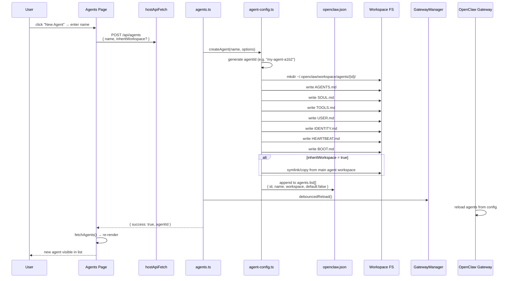
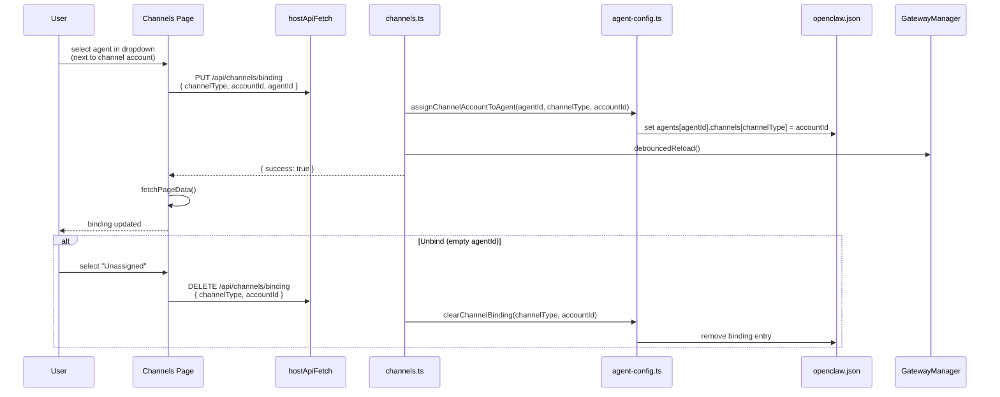
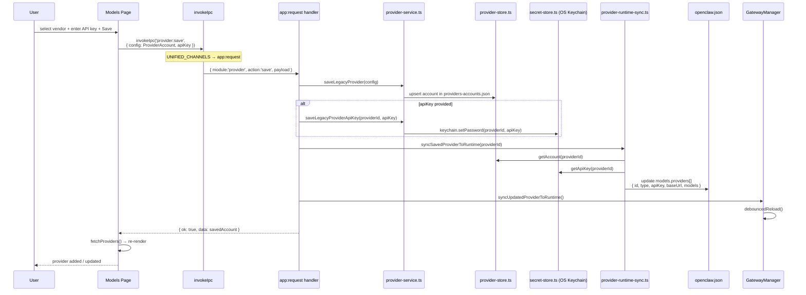
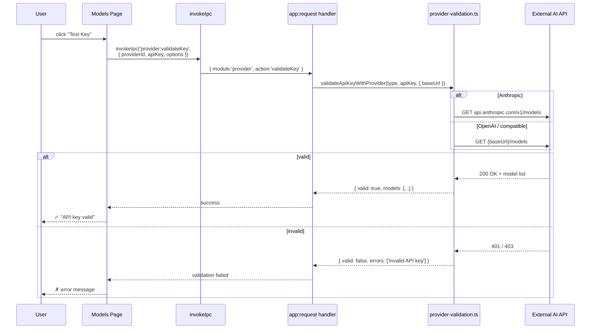
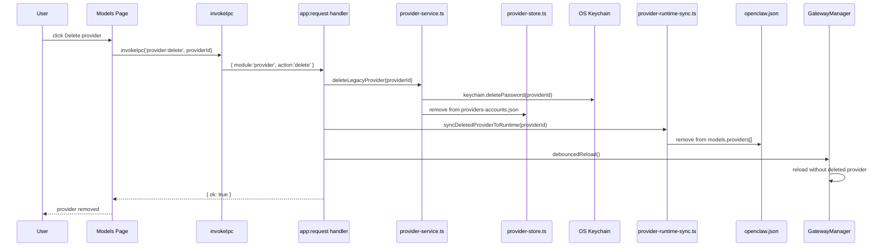

# UML — Agent & Provider Data Flow

## Create Agent Flow

```mermaid
sequenceDiagram
    participant User
    participant Page as Agents Page
    participant HA as hostApiFetch
    participant Route as agents.ts
    participant AgCfg as agent-config.ts
    participant OCJson as openclaw.json
    participant FS as Workspace FS
    participant GM as GatewayManager
    participant GW as OpenClaw Gateway

    User->>Page: click "New Agent" → enter name
    Page->>HA: POST /api/agents<br/>{ name, inheritWorkspace? }

    Route->>AgCfg: createAgent(name, options)

    AgCfg->>AgCfg: generate agentId (e.g. "my-agent-a1b2")
    AgCfg->>FS: mkdir ~/.openclaw/workspace/agents/{id}/

    AgCfg->>FS: write AGENTS.md
    AgCfg->>FS: write SOUL.md
    AgCfg->>FS: write TOOLS.md
    AgCfg->>FS: write USER.md
    AgCfg->>FS: write IDENTITY.md
    AgCfg->>FS: write HEARTBEAT.md
    AgCfg->>FS: write BOOT.md

    alt inheritWorkspace = true
        AgCfg->>FS: symlink/copy from main agent workspace
    end

    AgCfg->>OCJson: append to agents.list[]<br/>{ id, name, workspace, default:false }

    Route->>GM: debouncedReload()
    GW->>GW: reload agents from config

    Route-->>Page: { success: true, agentId }
    Page->>Page: fetchAgents() → re-render
    Page-->>User: new agent visible in list
```

---

## Agent Bind Channel Flow

```mermaid
sequenceDiagram
    participant User
    participant Page as Channels Page
    participant HA as hostApiFetch
    participant Route as channels.ts
    participant AgCfg as agent-config.ts
    participant OCJson as openclaw.json
    participant GM as GatewayManager

    User->>Page: select agent in dropdown<br/>(next to channel account)
    Page->>HA: PUT /api/channels/binding<br/>{ channelType, accountId, agentId }

    Route->>AgCfg: assignChannelAccountToAgent(agentId, channelType, accountId)
    AgCfg->>OCJson: set agents[agentId].channels[channelType] = accountId

    Route->>GM: debouncedReload()

    Route-->>Page: { success: true }
    Page->>Page: fetchPageData()
    Page-->>User: binding updated

    alt Unbind (empty agentId)
        User->>Page: select "Unassigned"
        Page->>HA: DELETE /api/channels/binding<br/>{ channelType, accountId }
        Route->>AgCfg: clearChannelBinding(channelType, accountId)
        AgCfg->>OCJson: remove binding entry
    end
```

---

## Add Provider / Model Flow

```mermaid
sequenceDiagram
    participant User
    participant Page as Models Page
    participant AC as invokeIpc
    participant IPC as app:request handler
    participant PrSvc as provider-service.ts
    participant PrStore as provider-store.ts
    participant SecStore as secret-store.ts (OS Keychain)
    participant RTSync as provider-runtime-sync.ts
    participant OCJson as openclaw.json
    participant GM as GatewayManager

    User->>Page: select vendor + enter API key + Save
    Page->>AC: invokeIpc('provider:save',<br/>{ config: ProviderAccount, apiKey })

    Note over AC: UNIFIED_CHANNELS → app:request
    AC->>IPC: { module:'provider', action:'save', payload }

    IPC->>PrSvc: saveLegacyProvider(config)
    PrSvc->>PrStore: upsert account in providers-accounts.json

    alt apiKey provided
        IPC->>PrSvc: saveLegacyProviderApiKey(providerId, apiKey)
        PrSvc->>SecStore: keychain.setPassword(providerId, apiKey)
    end

    IPC->>RTSync: syncSavedProviderToRuntime(providerId)
    RTSync->>PrStore: getAccount(providerId)
    RTSync->>SecStore: getApiKey(providerId)
    RTSync->>OCJson: update models.providers[]<br/>{ id, type, apiKey, baseUrl, models }

    IPC->>GM: syncUpdatedProviderToRuntime()
    GM->>GM: debouncedReload()

    IPC-->>Page: { ok: true, data: savedAccount }
    Page->>Page: fetchProviders() → re-render
    Page-->>User: provider added / updated
```

---

## Validate API Key Flow

```mermaid
sequenceDiagram
    participant User
    participant Page as Models Page
    participant AC as invokeIpc
    participant IPC as app:request handler
    participant PrVal as provider-validation.ts
    participant Ext as External AI API

    User->>Page: click "Test Key"
    Page->>AC: invokeIpc('provider:validateKey',<br/>{ providerId, apiKey, options })

    AC->>IPC: { module:'provider', action:'validateKey' }

    IPC->>PrVal: validateApiKeyWithProvider(type, apiKey, { baseUrl })

    alt Anthropic
        PrVal->>Ext: GET api.anthropic.com/v1/models
    else OpenAI / compatible
        PrVal->>Ext: GET {baseUrl}/models
    end

    alt valid
        Ext-->>PrVal: 200 OK + model list
        PrVal-->>IPC: { valid: true, models: [...] }
        IPC-->>Page: success
        Page-->>User: ✓ "API key valid"
    else invalid
        Ext-->>PrVal: 401 / 403
        PrVal-->>IPC: { valid: false, errors: ['Invalid API key'] }
        IPC-->>Page: validation failed
        Page-->>User: ✗ error message
    end
```

---

## Delete Provider Flow

```mermaid
sequenceDiagram
    participant User
    participant Page as Models Page
    participant AC as invokeIpc
    participant IPC as app:request handler
    participant PrSvc as provider-service.ts
    participant PrStore as provider-store.ts
    participant SecStore as OS Keychain
    participant RTSync as provider-runtime-sync.ts
    participant OCJson as openclaw.json
    participant GM as GatewayManager

    User->>Page: click Delete provider
    Page->>AC: invokeIpc('provider:delete', providerId)

    AC->>IPC: { module:'provider', action:'delete' }
    IPC->>PrSvc: deleteLegacyProvider(providerId)

    PrSvc->>SecStore: keychain.deletePassword(providerId)
    PrSvc->>PrStore: remove from providers-accounts.json

    IPC->>RTSync: syncDeletedProviderToRuntime(providerId)
    RTSync->>OCJson: remove from models.providers[]

    IPC->>GM: debouncedReload()
    GM->>GM: reload without deleted provider

    IPC-->>Page: { ok: true }
    Page-->>User: provider removed
```
