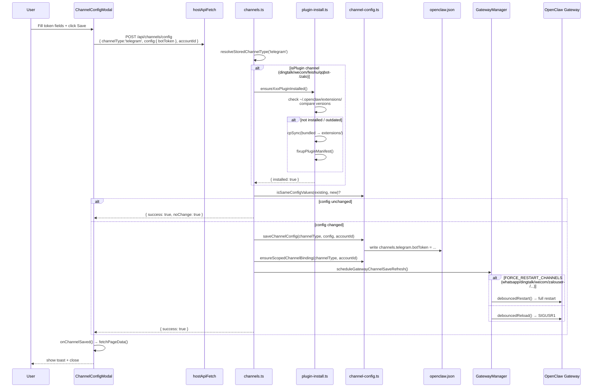
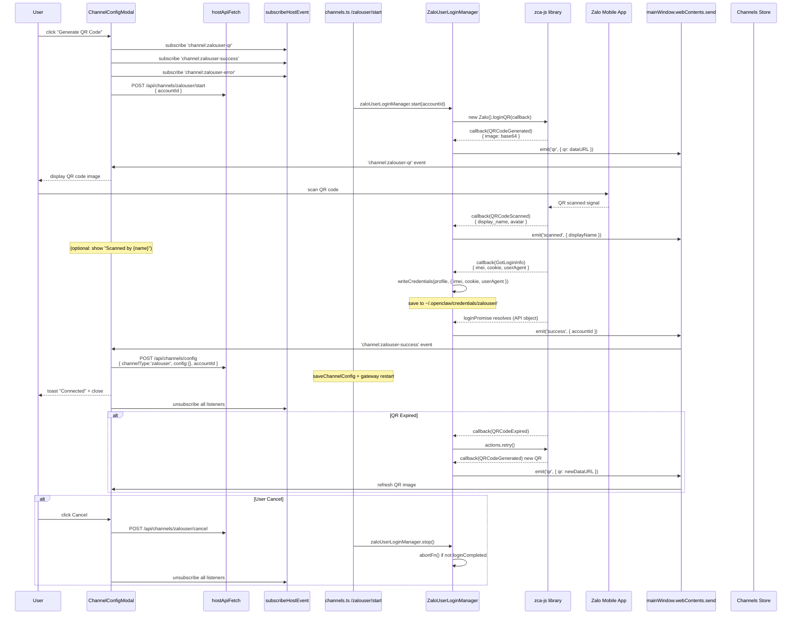
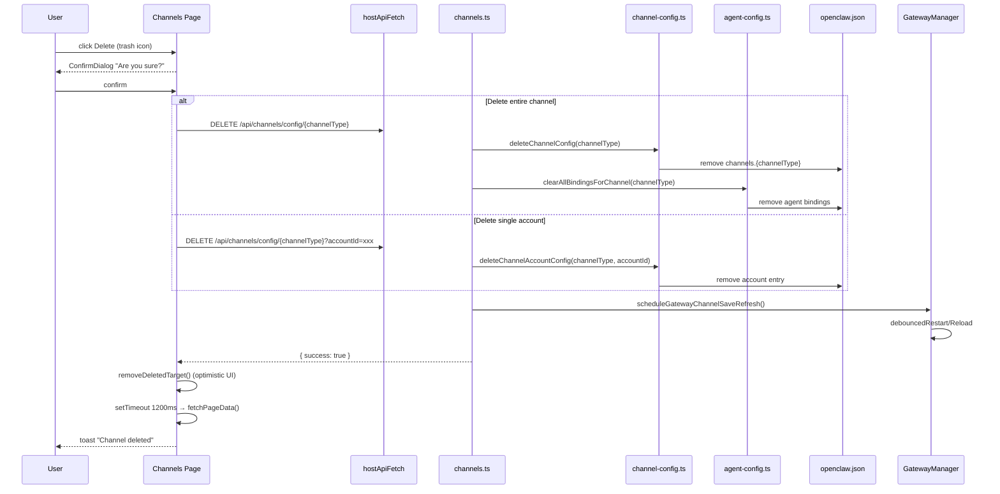
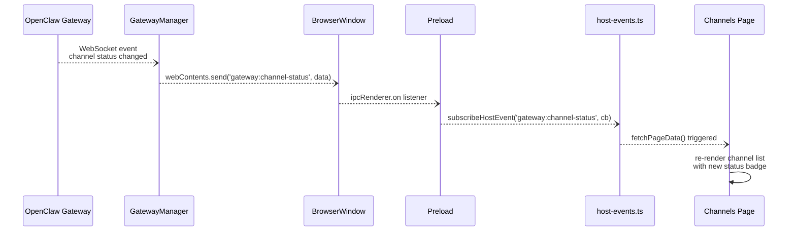

# UML — Channel Data Flow

## Channel Config Save (Token-based: Telegram, Discord, Zalo Bot)

---

## QR Login Flow — Zalo Personal

> **Status**: Planned. `ZaloUserLoginManager` and `electron/main/ipc/zalo.ts` have been created but not yet registered in `ipc-handlers.ts` / `channels.ts`. The route `/api/channels/zalouser/start` does not yet exist.

---

## Channel Delete Flow

---

## Channel Status Update (Realtime)

