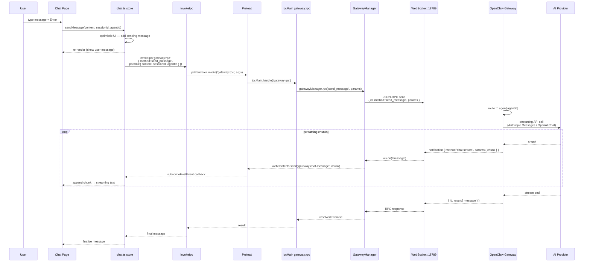
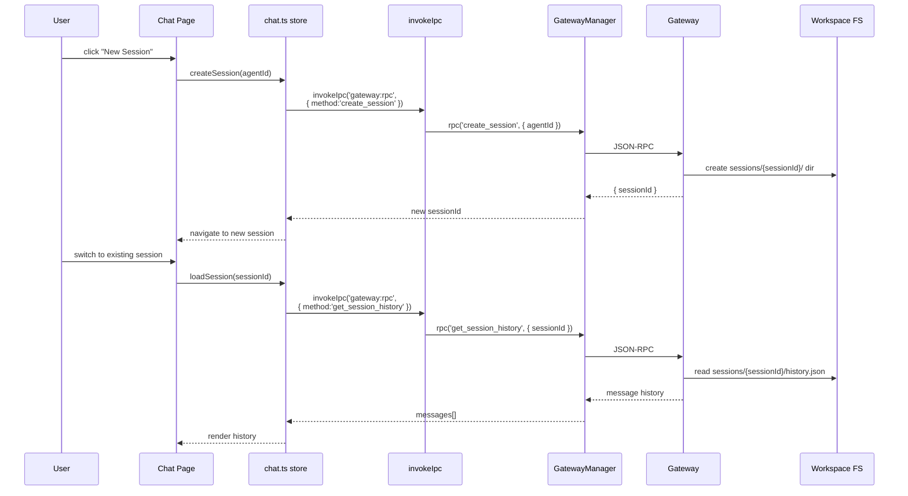
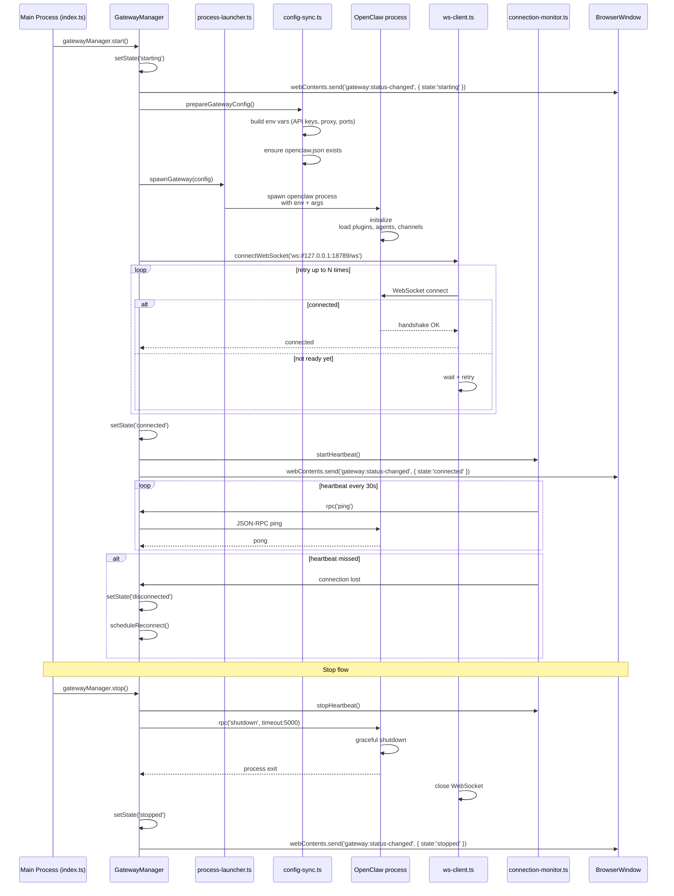
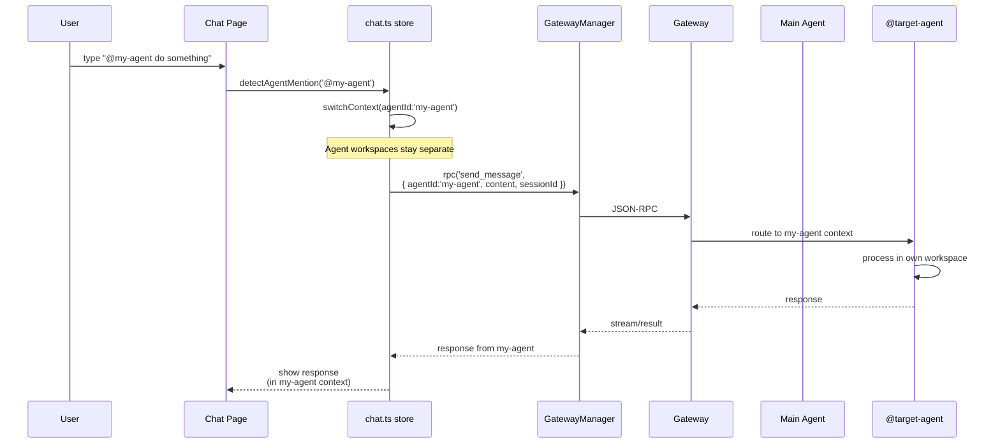

# UML — Chat & Gateway Data Flow

## Send Message Flow

```mermaid
sequenceDiagram
    participant User
    participant ChatUI as Chat Page
    participant ChatStore as chat.ts store
    participant AC as invokeIpc
    participant Pre as Preload
    participant GWH as ipcMain gateway:rpc
    participant GM as GatewayManager
    participant WS as WebSocket :18789
    participant GW as OpenClaw Gateway
    participant AI as AI Provider

    User->>ChatUI: type message + Enter
    ChatUI->>ChatStore: sendMessage(content, sessionId, agentId)

    ChatStore->>ChatStore: optimistic UI — add pending message
    ChatStore-->>ChatUI: re-render (show user message)

    ChatStore->>AC: invokeIpc('gateway:rpc',<br/>{ method:'send_message',<br/>  params:{ content, sessionId, agentId } })

    AC->>Pre: ipcRenderer.invoke('gateway:rpc', args)
    Pre->>GWH: ipcMain.handle('gateway:rpc')
    GWH->>GM: gatewayManager.rpc('send_message', params)
    GM->>WS: JSON-RPC send<br/>{ id, method:'send_message', params }

    GW->>GW: route to agent[agentId]
    GW->>AI: streaming API call<br/>(Anthropic Messages / OpenAI Chat)

    loop streaming chunks
        AI-->>GW: chunk
        GW-->>WS: notification { method:'chat.stream', params:{ chunk } }
        WS-->>GM: ws.on('message')
        GM-->>Pre: webContents.send('gateway:chat-message', chunk)
        Pre-->>ChatStore: subscribeHostEvent callback
        ChatStore-->>ChatUI: append chunk → streaming text
    end

    AI-->>GW: stream end
    GW-->>WS: { id, result:{ message } }
    WS-->>GM: RPC response
    GM-->>GWH: resolved Promise
    GWH-->>AC: result
    AC-->>ChatStore: final message
    ChatStore-->>ChatUI: finalize message
```

---

## Session Management

```mermaid
sequenceDiagram
    participant User
    participant ChatUI as Chat Page
    participant ChatStore as chat.ts store
    participant AC as invokeIpc
    participant GM as GatewayManager
    participant GW as Gateway
    participant FS as Workspace FS

    User->>ChatUI: click "New Session"
    ChatUI->>ChatStore: createSession(agentId)
    ChatStore->>AC: invokeIpc('gateway:rpc',<br/>{ method:'create_session' })
    AC->>GM: rpc('create_session', { agentId })
    GM->>GW: JSON-RPC
    GW->>FS: create sessions/{sessionId}/ dir
    GW-->>GM: { sessionId }
    GM-->>ChatStore: new sessionId
    ChatStore-->>ChatUI: navigate to new session

    User->>ChatUI: switch to existing session
    ChatUI->>ChatStore: loadSession(sessionId)
    ChatStore->>AC: invokeIpc('gateway:rpc',<br/>{ method:'get_session_history' })
    AC->>GM: rpc('get_session_history', { sessionId })
    GM->>GW: JSON-RPC
    GW->>FS: read sessions/{sessionId}/history.json
    GW-->>GM: message history
    GM-->>ChatStore: messages[]
    ChatStore-->>ChatUI: render history
```

---

## Gateway Start/Stop Flow

```mermaid
sequenceDiagram
    participant App as Main Process (index.ts)
    participant GM as GatewayManager
    participant Launch as process-launcher.ts
    participant ConfigSync as config-sync.ts
    participant GW as OpenClaw process
    participant WS as ws-client.ts
    participant Monitor as connection-monitor.ts
    participant Win as BrowserWindow

    App->>GM: gatewayManager.start()
    GM->>GM: setState('starting')
    GM->>Win: webContents.send('gateway:status-changed', { state:'starting' })

    GM->>ConfigSync: prepareGatewayConfig()
    ConfigSync->>ConfigSync: build env vars (API keys, proxy, ports)
    ConfigSync->>ConfigSync: ensure openclaw.json exists

    GM->>Launch: spawnGateway(config)
    Launch->>GW: spawn openclaw process<br/>with env + args

    GW->>GW: initialize<br/>load plugins, agents, channels

    GM->>WS: connectWebSocket('ws://127.0.0.1:18789/ws')

    loop retry up to N times
        WS->>GW: WebSocket connect
        alt connected
            GW-->>WS: handshake OK
            WS-->>GM: connected
        else not ready yet
            WS->>WS: wait + retry
        end
    end

    GM->>GM: setState('connected')
    GM->>Monitor: startHeartbeat()
    GM->>Win: webContents.send('gateway:status-changed', { state:'connected' })

    loop heartbeat every 30s
        Monitor->>GM: rpc('ping')
        GM->>GW: JSON-RPC ping
        GW-->>GM: pong
    end

    alt heartbeat missed
        Monitor->>GM: connection lost
        GM->>GM: setState('disconnected')
        GM->>GM: scheduleReconnect()
    end

    Note over App,Win: Stop flow
    App->>GM: gatewayManager.stop()
    GM->>Monitor: stopHeartbeat()
    GM->>GW: rpc('shutdown', timeout:5000)
    GW->>GW: graceful shutdown
    GW-->>GM: process exit
    WS->>WS: close WebSocket
    GM->>GM: setState('stopped')
    GM->>Win: webContents.send('gateway:status-changed', { state:'stopped' })
```

---

## @agent Routing (Multi-agent)

```mermaid
sequenceDiagram
    participant User
    participant ChatUI as Chat Page
    participant ChatStore as chat.ts store
    participant GM as GatewayManager
    participant GW as Gateway
    participant AgentA as Main Agent
    participant AgentB as @target-agent

    User->>ChatUI: type "@my-agent do something"
    ChatUI->>ChatStore: detectAgentMention('@my-agent')
    ChatStore->>ChatStore: switchContext(agentId:'my-agent')
    Note over ChatStore: Agent workspaces stay separate

    ChatStore->>GM: rpc('send_message',<br/>{ agentId:'my-agent', content, sessionId })
    GM->>GW: JSON-RPC
    GW->>AgentB: route to my-agent context
    AgentB->>AgentB: process in own workspace
    AgentB-->>GW: response
    GW-->>GM: stream/result
    GM-->>ChatStore: response from my-agent
    ChatStore-->>ChatUI: show response<br/>(in my-agent context)
```
