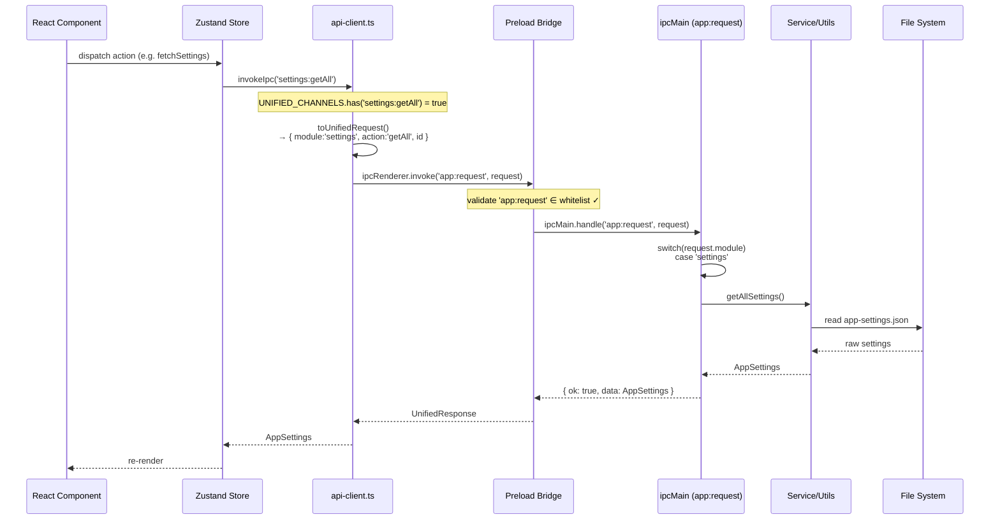
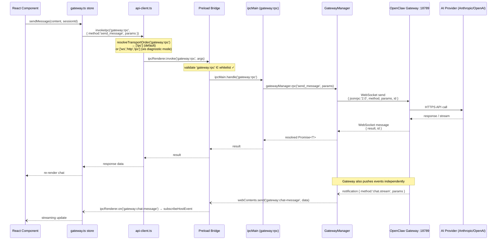
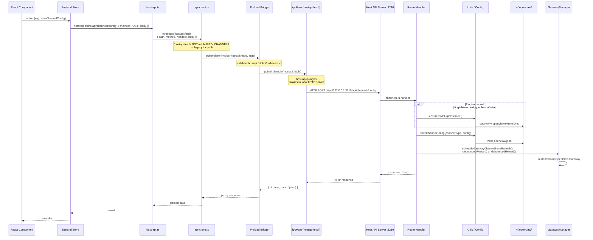
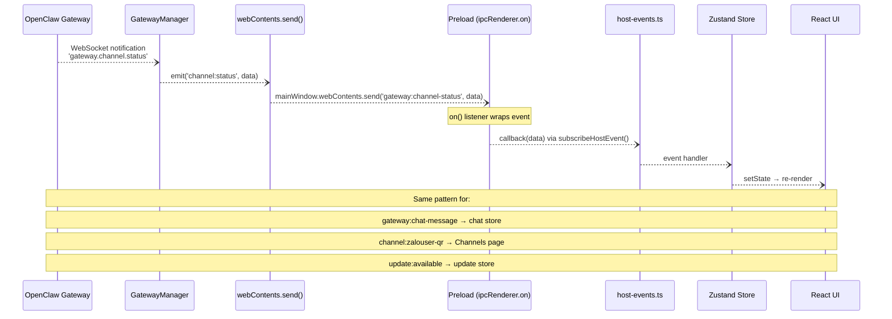

# UML — IPC Data Flow

## Path A — Unified Request (settings / provider / cron)

---

## Path B — Gateway RPC (chat / agents / cron runtime)

---

## Path C — Host API Fetch (channels / agents / skills)

---

## Push Events Flow (Main → Renderer)

