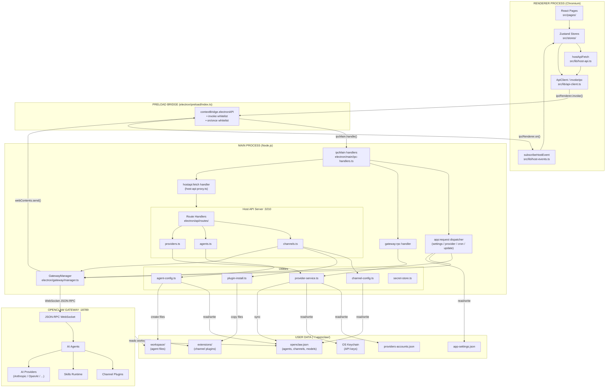
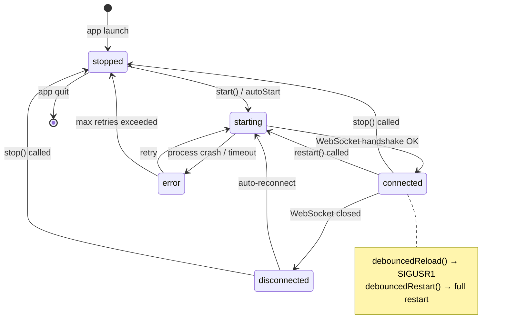
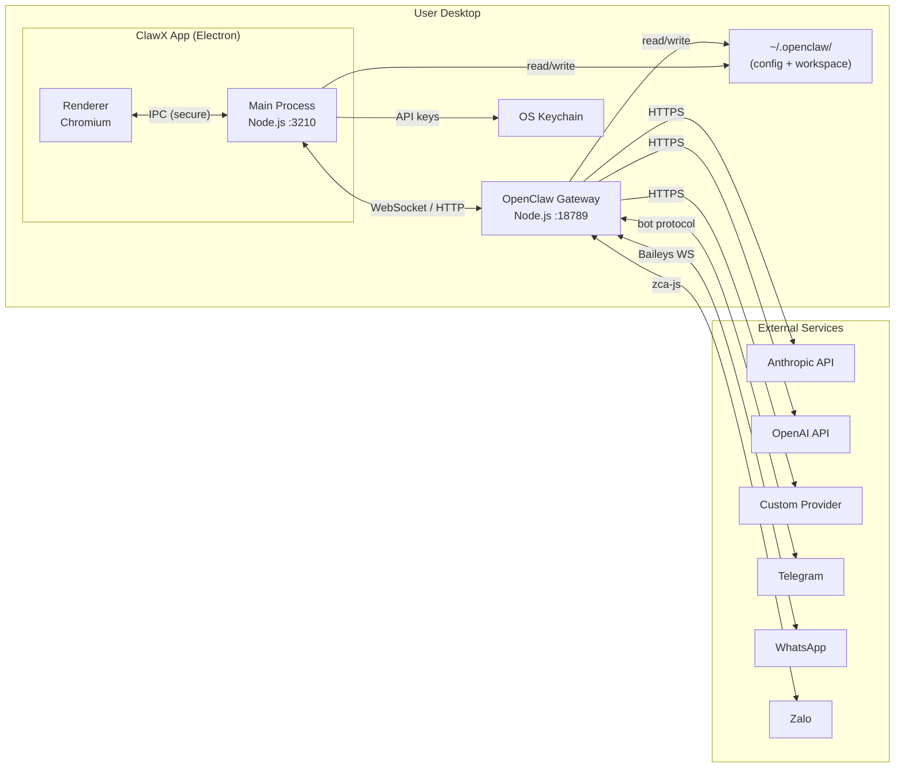

# UML — System Overview

## Component Diagram

```mermaid
graph TB
    subgraph Renderer["RENDERER PROCESS (Chromium)"]
        UI[React Pages<br/>src/pages/]
        Store[Zustand Stores<br/>src/stores/]
        HostAPI[hostApiFetch<br/>src/lib/host-api.ts]
        APIClient[ApiClient / invokeIpc<br/>src/lib/api-client.ts]
        Events[subscribeHostEvent<br/>src/lib/host-events.ts]

        UI --> Store
        Store --> HostAPI
        Store --> APIClient
        Events --> Store
        HostAPI --> APIClient
    end

    subgraph Preload["PRELOAD BRIDGE (electron/preload/index.ts)"]
        Bridge["contextBridge.electronAPI<br/>• invoke whitelist<br/>• on/once whitelist"]
    end

    subgraph Main["MAIN PROCESS (Node.js)"]
        IPC["ipcMain handlers<br/>electron/main/ipc-handlers.ts"]
        UnifiedReq["app:request dispatcher<br/>(settings / provider / cron / update)"]
        GWHandler["gateway:rpc handler"]
        ProxyHandler["hostapi:fetch handler<br/>(host-api-proxy.ts)"]
        GWMgr["GatewayManager<br/>electron/gateway/manager.ts"]

        subgraph HTTPServer["Host API Server :3210"]
            Routes["Route Handlers<br/>electron/api/routes/"]
            ChRoute["channels.ts"]
            AgRoute["agents.ts"]
            PrRoute["providers.ts"]
            Routes --> ChRoute
            Routes --> AgRoute
            Routes --> PrRoute
        end

        subgraph Utils["Utilities"]
            ChConfig["channel-config.ts"]
            AgConfig["agent-config.ts"]
            PrService["provider-service.ts"]
            PluginInst["plugin-install.ts"]
            SecStore["secret-store.ts"]
        end

        IPC --> UnifiedReq
        IPC --> GWHandler
        IPC --> ProxyHandler
        ProxyHandler --> HTTPServer
        UnifiedReq --> PrService
        UnifiedReq --> GWMgr
        ChRoute --> ChConfig
        ChRoute --> PluginInst
        ChRoute --> GWMgr
        AgRoute --> AgConfig
        PrRoute --> PrService
        GWHandler --> GWMgr
    end

    subgraph Storage["USER DATA (~/.openclaw/)"]
        OCJson["openclaw.json<br/>(agents, channels, models)"]
        AppSet["app-settings.json"]
        PrJson["providers-accounts.json"]
        Keychain["OS Keychain<br/>(API keys)"]
        Extensions["extensions/<br/>(channel plugins)"]
        Workspace["workspace/<br/>(agent files)"]
    end

    subgraph Gateway["OPENCLAW GATEWAY :18789"]
        GWRPC["JSON-RPC WebSocket"]
        Agents["AI Agents"]
        Channels["Channel Plugins"]
        Skills["Skills Runtime"]
        AIProviders["AI Providers<br/>(Anthropic / OpenAI / ...)"]

        GWRPC --> Agents
        Agents --> Channels
        Agents --> Skills
        Agents --> AIProviders
    end

    APIClient -->|"ipcRenderer.invoke()"| Bridge
    Bridge -->|"ipcMain.handle()"| IPC
    GWMgr -->|"WebSocket JSON-RPC"| GWRPC
    GWMgr -->|"webContents.send()"| Bridge
    Bridge -->|"ipcRenderer.on()"| Events

    ChConfig -->|"read/write"| OCJson
    AgConfig -->|"read/write"| OCJson
    PrService -->|"read/write"| PrJson
    PrService -->|"read/write"| Keychain
    PrService -->|"sync"| OCJson
    PluginInst -->|"copy files"| Extensions
    AgConfig -->|"create files"| Workspace
    UnifiedReq -->|"read/write"| AppSet

    Gateway -->|"reads config"| OCJson
    Gateway -->|"loads plugins"| Extensions
    Gateway -->|"reads workspace"| Workspace
```

---

## State Machine — Gateway Lifecycle

```mermaid
stateDiagram-v2
    [*] --> stopped : app launch

    stopped --> starting : start() / autoStart
    starting --> connected : WebSocket handshake OK
    starting --> error : process crash / timeout

    connected --> disconnected : WebSocket closed
    connected --> stopped : stop() called
    connected --> starting : restart() called

    disconnected --> starting : auto-reconnect
    disconnected --> stopped : stop() called

    error --> starting : retry
    error --> stopped : max retries exceeded

    stopped --> [*] : app quit

    note right of connected
        debouncedReload() → SIGUSR1
        debouncedRestart() → full restart
    end note
```

---

## Deployment Diagram

```mermaid
graph LR
    subgraph Desktop["User Desktop"]
        subgraph ElectronApp["ClawX App (Electron)"]
            RP["Renderer\nChromium"]
            MP["Main Process\nNode.js :3210"]
            RP <-->|"IPC (secure)"| MP
        end
        GW["OpenClaw Gateway\nNode.js :18789"]
        MP <-->|"WebSocket / HTTP"| GW
        FS["~/.openclaw/\n(config + workspace)"]
        GW -->|"read/write"| FS
        MP -->|"read/write"| FS
        KC["OS Keychain"]
        MP -->|"API keys"| KC
    end

    subgraph Cloud["External Services"]
        AI1["Anthropic API"]
        AI2["OpenAI API"]
        AI3["Custom Provider"]
        TG["Telegram"]
        WA["WhatsApp"]
        ZA["Zalo"]
    end

    GW -->|"HTTPS"| AI1
    GW -->|"HTTPS"| AI2
    GW -->|"HTTPS"| AI3
    GW <-->|"bot protocol"| TG
    GW <-->|"Baileys WS"| WA
    GW <-->|"zca-js"| ZA
```
